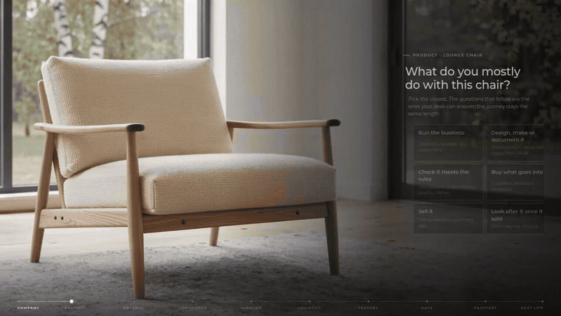

# Furniture DPP readiness

Sprint prototype for Friday. Not the live Prduct product.

[](docs/github/journey.mp4)

The camera follows one lounge chair through the assessment: company, product, material, component, supplier, logistics, factory, data, passport, next life. [Play the film](docs/github/journey.mp4) · [Open the page](https://demosprint.vercel.app)

## What this is

A Prduct-styled Digital Product Passport assessment. The header stays. Under it, the journey asks one situation at each stop and ends in the Product Data Landscape. The earlier linear quiz is still at `/classic.html`.

Sales and purchasing each get the version of the path that matches the desk. The result shows the diagram and the echoed facts. No score, no month band.

## For Friday

| | |
| --- | --- |
| Page | https://demosprint.vercel.app |
| Code | `main` on [gvitolocs/prduct_sprint](https://github.com/gvitolocs/prduct_sprint) |
| Handoff | [`_handoff/DPP-Assessment-Code-Handoff.md`](_handoff/DPP-Assessment-Code-Handoff.md) |
| Against the list | [`_handoff/DPP-Assessment-Friday-Line-As-Shipped.md`](_handoff/DPP-Assessment-Friday-Line-As-Shipped.md) |

## Run it

```bash
git clone https://github.com/gvitolocs/prduct_sprint.git
cd prduct_sprint
python3 server.py
```

Open http://127.0.0.1:8787/. Checks: `node --test pathfinder/tests/*.test.mjs`.

| Path | What it is |
| --- | --- |
| `index.html`, `journey/` | The page and the camera |
| `pathfinder/lifecycle.js` | Questions, routing, ladders |
| `inbox.html`, `api/` | Responses, behind a password |
| `docs/qualification/` | The Friday plan, as received |
| `docs/github/journey.mp4` | The film on this page |
