# Journey catalogue

Every asset and question of the cinematic assessment, one entry each. Generated 2026-10-01 12:51 UTC by `node tools/catalogue.mjs` from the files the site runs on — do not edit by hand. Review notes live in `docs/journey/notes.json` (keyed by ID).

**IDs** — `FUR`/`BAT`/`TEX` = furniture / battery / textile · `S04` = still at stop 4 · `M04` = move from stop 4 to 5 · `Q:<id>` = question (`#<option>` = one answer) · `L:` end-pane block · `O:` overlay · `C:` copy block · `D:` scored dashboard card (internal preview only).

**Open review notes (11)** — `FUR-S09` (refine), `FUR-S10` (check), `BAT-S04` (refine), `BAT-S06` (check), `BAT-S07` (refine), `BAT-M07` (check), `TEX-S04` (refine), `TEX-S07` (refine), `TEX-S10` (refine), `TEX-M09` (refine), `FUR-S06` (check)

## Contents

- [Furniture · Lounge chair](#furniture)
- [Battery & e-mobility · E-bike battery](#battery)
- [Textiles & apparel · Rain jacket](#textile)
- [Questions](#questions)
- [End pane](#end-pane)
- [Overlays and copy](#overlays-and-copy)
- [Internal preview: scored dashboard](#dashboard)

## Furniture · Lounge chair (FUR)

Desktop framing for the whole branch: `0% 60%` (phones use each stop's own focus).

| Stop | Still | Questions here | Move to next |
|---|---|---|---|
| 01 Company | `FUR-S01` | — | `FUR-M01` |
| 02 Product | `FUR-S02` | `Q:product.perspective` `Q:sales.channel` `Q:product.identity` | `FUR-M02` |
| 03 Material | `FUR-S03` | `Q:sourcing.topten` `Q:sales.artefact` `Q:material.composition` | `FUR-M03` |
| 04 Component | `FUR-S04` | `Q:sales.landing` `Q:component.bom` | `FUR-M04` |
| 05 Supplier | `FUR-S05` | `Q:sales.certificates` `Q:supplier.role` `Q:supplier.depth` `Q:supplier.proof` `Q:supplier.trace` `Q:sourcing.whoasks` `Q:sourcing.contract` | `FUR-M05` |
| 06 Logistics | `FUR-S06` | `Q:sourcing.substitution` `Q:sales.orders` `Q:logistics.handoff` `Q:logistics.change` | `FUR-M06` |
| 07 Factory | `FUR-S07` | `Q:sourcing.contractmade` `Q:sales.reorder` `Q:factory.evidence` | `FUR-M07` |
| 08 Data | `FUR-S08` | `Q:data.location` `Q:data.retrieval` `Q:sourcing.pdf` `Q:sales.hours` `Q:data.owner` | `FUR-M08` |
| 09 Passport | `FUR-S09` | `Q:sales.unbid` `Q:passport.carrier` `Q:regulation.scope` | `FUR-M09` |
| 10 Next life | `FUR-S10` | `Q:nextLife.continuity` `Q:nextLife.unlock` | — |

### FUR-S01 · Company

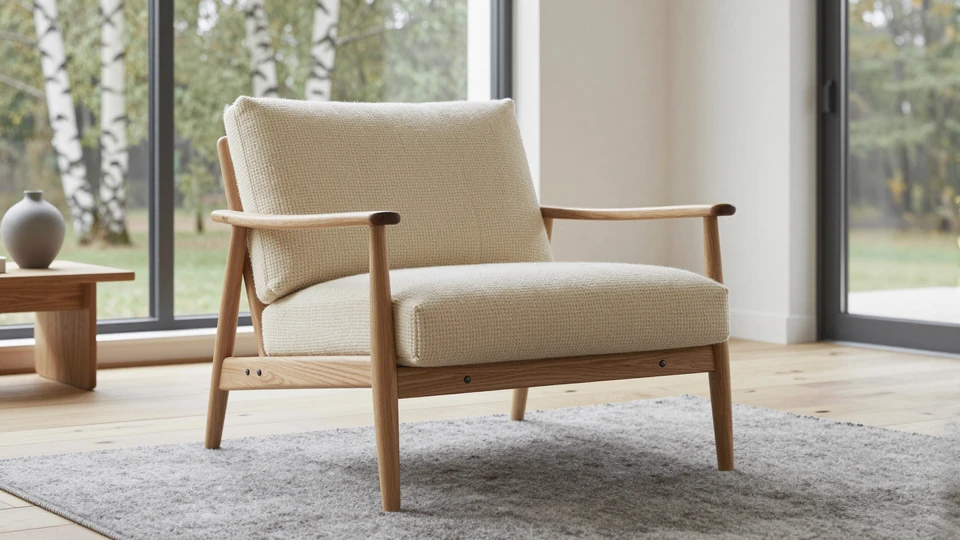

- **Alt text:** A Danish oak lounge chair by tall windows in a bright Nordic living room
- **Framing:** focus `45% 60%`, question panel right
- **Made:** v4: the still is the motion base's own end frame (tools/rig.py), composited from the same layers the clip moves - lounge master photo, the chair's real parts cut from it (SAM 2.1 + BiRefNet), plates made with Z-Image-Turbo / Qwen-Image-Edit, the oak macro and the prduct.com QR burn
- **Source:** `work/v4/bases/T1_first.png`
- **Files:** master `journey-media/final/furniture/company.png`; web 4 files (`journey/media/furniture/company-1920.avif` …), 1920 AVIF 158 KB
- **Questions:** none (selector card)

### FUR-M01 · Company → Product

[▶ journey/media/furniture/company-product-540-h264.mp4](../../journey/media/furniture/company-product-540-h264.mp4) — `FUR-S01` → `FUR-S02`

- **Timing:** 97 frames · 24 fps · 4.042 s · question cue at 80%
- **Made:** v4: 2.5D layer animation (real object and camera motion: parts float apart, the leg frame glides, turns, travels and lands, the chair flies; laser raster reveal) rendered by LTX-2.5 video-to-video at denoise 0.975 with BOTH end stills as guides (frame 0 and the last frame)
- **Move:** `T1` · scene `work/v4/scenes/T1_company-product.json` · seed 101 · take `work/v4/clips/T1.mp4`
- **Prompt:** A slow, smooth camera pan to the right across a bright, calm Scandinavian living room: a low oak lounge armchair with cream basket-weave wool cushions on a pale grey rug by tall black-framed windows; outside, white birch trunks and autumn leaves sway gently in a light breeze; soft overcast daylight. Photorealistic, premium Nordic product cinematography, real optical depth of field, natural motion blur, steady and smooth, one continuous shot, no cuts, no text.
- **Files:** master `journey-media/final/furniture/company-product.mp4`; web 4 files, 1080 AV1 1615 KB

### FUR-S02 · Product

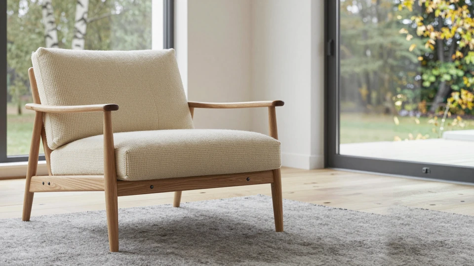

- **Alt text:** The oak lounge chair with cream basket-weave cushions
- **Framing:** focus `30% 60%`, question panel right
- **Made:** v4: the still is the motion base's own end frame (tools/rig.py), composited from the same layers the clip moves - lounge master photo, the chair's real parts cut from it (SAM 2.1 + BiRefNet), plates made with Z-Image-Turbo / Qwen-Image-Edit, the oak macro and the prduct.com QR burn
- **Source:** `work/v4/bases/T2_first.png`
- **Files:** master `journey-media/final/furniture/product.png`; web 4 files (`journey/media/furniture/product-1920.avif` …), 1920 AVIF 164 KB
- **Questions:** `Q:product.perspective`, `Q:sales.channel`, `Q:product.identity`

### FUR-M02 · Product → Material

[▶ journey/media/furniture/product-material-540-h264.mp4](../../journey/media/furniture/product-material-540-h264.mp4) — `FUR-S02` → `FUR-S03`

- **Timing:** 97 frames · 24 fps · 4.042 s · question cue at 80%
- **Made:** v4: 2.5D layer animation (real object and camera motion: parts float apart, the leg frame glides, turns, travels and lands, the chair flies; laser raster reveal) rendered by LTX-2.5 video-to-video at denoise 0.975 with BOTH end stills as guides (frame 0 and the last frame)
- **Move:** `T2` · scene `work/v4/scenes/T2_product-material.json` · seed 202 · take `work/v4/clips/T2.mp4`
- **Prompt:** The camera glides smoothly toward the oak lounge armchair and pushes in close to the flat oak side rail below its seat, until the fine straight grain of the oak fills the whole frame: grain lines, silvery ray flecks and pores coming into sharp focus. One continuous, steady camera move, macro lens at the end. Photorealistic, premium Nordic product cinematography, real optical depth of field, natural motion blur, steady and smooth, one continuous shot, no cuts, no text.
- **Files:** master `journey-media/final/furniture/product-material.mp4`; web 4 files, 1080 AV1 1808 KB

### FUR-S03 · Material

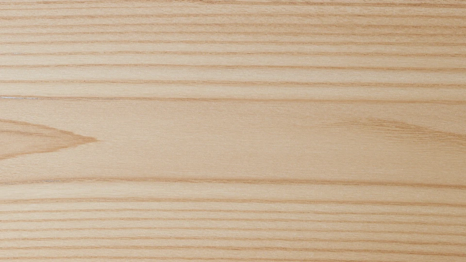

- **Alt text:** The oak of the chair's side rail, close up: straight grain and silver ray flecks
- **Framing:** focus `50% 50%`, question panel right
- **Made:** v4: the still is the motion base's own end frame (tools/rig.py), composited from the same layers the clip moves - lounge master photo, the chair's real parts cut from it (SAM 2.1 + BiRefNet), plates made with Z-Image-Turbo / Qwen-Image-Edit, the oak macro and the prduct.com QR burn
- **Source:** `work/v4/bases/T3_first.png`
- **Files:** master `journey-media/final/furniture/material.png`; web 4 files (`journey/media/furniture/material-1920.avif` …), 1920 AVIF 126 KB
- **Questions:** `Q:sourcing.topten`, `Q:sales.artefact`, `Q:material.composition`

### FUR-M03 · Material → Component

[▶ journey/media/furniture/material-component-540-h264.mp4](../../journey/media/furniture/material-component-540-h264.mp4) — `FUR-S03` → `FUR-S04`

- **Timing:** 97 frames · 24 fps · 4.042 s · question cue at 80%
- **Made:** v4: 2.5D layer animation (real object and camera motion: parts float apart, the leg frame glides, turns, travels and lands, the chair flies; laser raster reveal) rendered by LTX-2.5 video-to-video at denoise 0.975 with BOTH end stills as guides (frame 0 and the last frame)
- **Move:** `T3` · scene `work/v4/scenes/T3_material-component.json` · seed 303 · take `work/v4/clips/T3_b.mp4`
- **Prompt:** Starting on an extreme macro of oak grain, the camera pulls smoothly back to reveal the oak lounge armchair in a bright living room; then the chair gently comes apart in mid-air: the two oak side frames drift outward, the cushions lift up together, the front and back rails drop a little, and graphite bolts slide out of their holes, until every part floats weightlessly, spaced apart like a real exploded view. Photorealistic, premium Nordic product cinematography, real optical depth of field, natural motion blur, steady and smooth, one continuous shot, no cuts, no text.
- **Files:** master `journey-media/final/furniture/material-component.mp4`; web 4 files, 1080 AV1 1591 KB

### FUR-S04 · Component

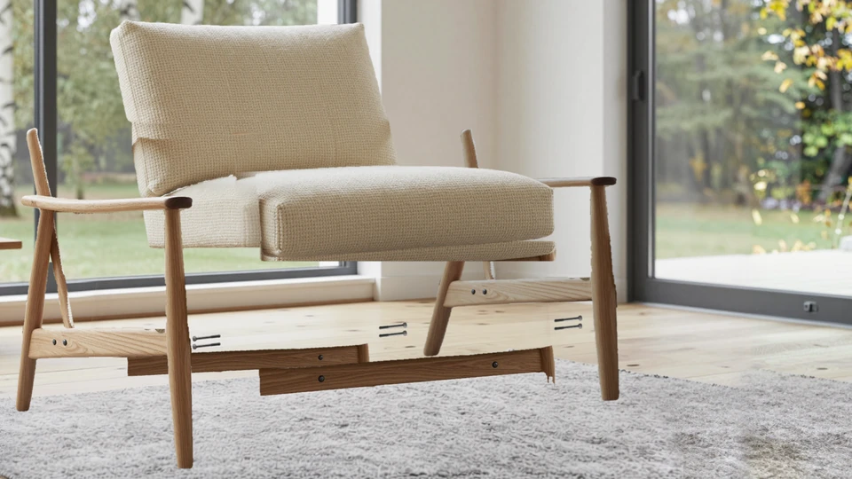

- **Alt text:** The lounge chair opened up: cushions off, black webbing and foam showing, a tray of bolts and nuts on the rug
- **Framing:** focus `30% 55%`, question panel right
- **Made:** v4: the still is the motion base's own end frame (tools/rig.py), composited from the same layers the clip moves - lounge master photo, the chair's real parts cut from it (SAM 2.1 + BiRefNet), plates made with Z-Image-Turbo / Qwen-Image-Edit, the oak macro and the prduct.com QR burn
- **Source:** `work/v4/bases/T4_first.png`
- **Files:** master `journey-media/final/furniture/component.png`; web 4 files (`journey/media/furniture/component-1920.avif` …), 1920 AVIF 80 KB
- **Questions:** `Q:sales.landing`, `Q:component.bom`

> **OK** — v5 (2026-09-30): the real chair from stop 2 opened up (Qwen edit, two passes): cushions off, back and seat webbing, foam in the unzipped cushion, a tray of fittings. The stop-3 oak macro pulls straight back onto the same side rail (FUR-M03).

### FUR-M04 · Component → Supplier

[▶ journey/media/furniture/component-supplier-540-h264.mp4](../../journey/media/furniture/component-supplier-540-h264.mp4) — `FUR-S04` → `FUR-S05`

- **Timing:** 49 frames · 24 fps · 2.042 s · question cue at 80%
- **Made:** v4: 2.5D layer animation (real object and camera motion: parts float apart, the leg frame glides, turns, travels and lands, the chair flies; laser raster reveal) rendered by LTX-2.5 video-to-video at denoise 0.975 with BOTH end stills as guides (frame 0 and the last frame)
- **Move:** `T4` · scene `work/v4/scenes/T4_component-supplier.json` · seed 404 · take `work/v4/clips/T4_b.mp4`
- **Prompt:** The parts of a disassembled oak lounge chair float in mid-air in a bright living room. One oak side frame - front leg, rear leg, back stile, armrest and side rail in one piece - glides smoothly toward the camera and turns slightly, while the other parts drift back and fall softly out of focus behind it. Rack focus onto the oak frame. Photorealistic, premium Nordic product cinematography, real optical depth of field, natural motion blur, steady and smooth, one continuous shot, no cuts, no text.
- **Files:** master `journey-media/final/furniture/component-supplier.mp4`; web 4 files, 1080 AV1 1673 KB

### FUR-S05 · Supplier

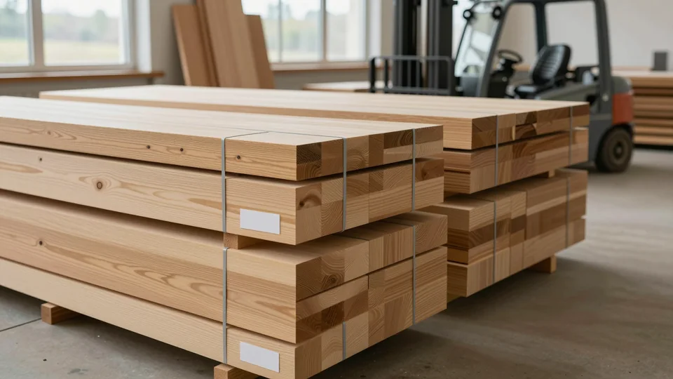

- **Alt text:** Felled oak logs piled beside a misty forest road, small tags on their cut ends
- **Framing:** focus `35% 60%`, question panel right
- **Made:** v4: the still is the motion base's own end frame (tools/rig.py), composited from the same layers the clip moves - lounge master photo, the chair's real parts cut from it (SAM 2.1 + BiRefNet), plates made with Z-Image-Turbo / Qwen-Image-Edit, the oak macro and the prduct.com QR burn
- **Source:** `work/v4/bases/T5_first.png`
- **Files:** master `journey-media/final/furniture/supplier.png`; web 4 files (`journey/media/furniture/supplier-1920.avif` …), 1920 AVIF 333 KB
- **Questions:** `Q:sales.certificates`, `Q:supplier.role`, `Q:supplier.depth`, `Q:supplier.proof`, `Q:supplier.trace`, `Q:sourcing.whoasks`, `Q:sourcing.contract`

> **OK** — v5: felled oak logs beside a misty forest road (Z-Image-Turbo), tags on the cut ends. Reached by a whip pan from the lounge (FUR-M04).

### FUR-M05 · Supplier → Logistics

[▶ journey/media/furniture/supplier-logistics-540-h264.mp4](../../journey/media/furniture/supplier-logistics-540-h264.mp4) — `FUR-S05` → `FUR-S06`

- **Timing:** 97 frames · 24 fps · 4.042 s · question cue at 80%
- **Made:** v4: 2.5D layer animation (real object and camera motion: parts float apart, the leg frame glides, turns, travels and lands, the chair flies; laser raster reveal) rendered by LTX-2.5 video-to-video at denoise 0.975 with BOTH end stills as guides (frame 0 and the last frame)
- **Move:** `T5` · scene `work/v4/scenes/T5_supplier-logistics.json` · seed 505 · take `work/v4/clips/T5_b.mp4`
- **Prompt:** An oak chair side frame floats in mid-air in the foreground, sharp, while the camera travels with it: behind it the bright living room whips away sideways in a streak of motion blur and a bright furniture component factory hall slides in, softly out of focus, with a work table, a marking machine and pallets of wrapped chairs. The frame drifts and turns slightly as it travels. Photorealistic, premium Nordic product cinematography, real optical depth of field, natural motion blur, steady and smooth, one continuous shot, no cuts, no text.
- **Files:** master `journey-media/final/furniture/supplier-logistics.mp4`; web 4 files, 1080 AV1 3485 KB

### FUR-S06 · Logistics

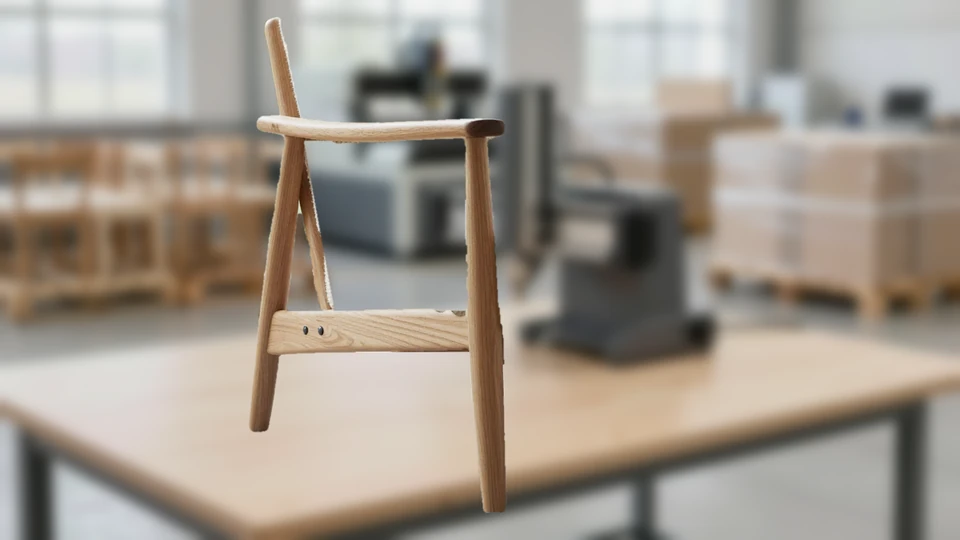

- **Alt text:** Strapped bundles of oak boards on pallets in the factory's loading bay, a truck and a forklift behind
- **Framing:** focus `40% 60%`, question panel right
- **Made:** v4: the still is the motion base's own end frame (tools/rig.py), composited from the same layers the clip moves - lounge master photo, the chair's real parts cut from it (SAM 2.1 + BiRefNet), plates made with Z-Image-Turbo / Qwen-Image-Edit, the oak macro and the prduct.com QR burn
- **Source:** `work/v4/bases/T6_first.png`
- **Files:** master `journey-media/final/furniture/logistics.png`; web 4 files (`journey/media/furniture/logistics-1920.avif` …), 1920 AVIF 105 KB
- **Questions:** `Q:sourcing.substitution`, `Q:sales.orders`, `Q:logistics.handoff`, `Q:logistics.change`

> **CHECK** — v5: bundles of oak boards in the loading bay (Z-Image-Turbo). The bundle ends are a slightly busy mosaic; the truck stands inside the hall.

### FUR-M06 · Logistics → Factory

[▶ journey/media/furniture/logistics-factory-540-h264.mp4](../../journey/media/furniture/logistics-factory-540-h264.mp4) — `FUR-S06` → `FUR-S07`

- **Timing:** 49 frames · 24 fps · 2.042 s · question cue at 80%
- **Made:** v4: 2.5D layer animation (real object and camera motion: parts float apart, the leg frame glides, turns, travels and lands, the chair flies; laser raster reveal) rendered by LTX-2.5 video-to-video at denoise 0.975 with BOTH end stills as guides (frame 0 and the last frame)
- **Move:** `T6` · scene `work/v4/scenes/T6_logistics-factory.json` · seed 606 · take `work/v4/clips/T6.mp4`
- **Prompt:** An oak chair side frame floats in a bright factory hall, then turns and glides down to lie flat on a pale beech work table under the head of a compact laser marking machine; the focus racks from the floating frame to the sharp station. Gentle, weightless landing, soft contact shadow. Photorealistic, premium Nordic product cinematography, real optical depth of field, natural motion blur, steady and smooth, one continuous shot, no cuts, no text.
- **Files:** master `journey-media/final/furniture/logistics-factory.mp4`; web 4 files, 1080 AV1 911 KB

### FUR-S07 · Factory

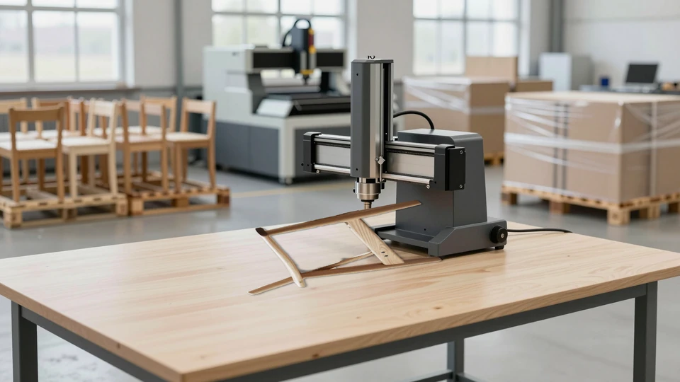

- **Alt text:** A flatbed laser engraver in the chair factory, oak rails on its bed under the laser head
- **Framing:** focus `62% 55%`, question panel left
- **Made:** v4: the still is the motion base's own end frame (tools/rig.py), composited from the same layers the clip moves - lounge master photo, the chair's real parts cut from it (SAM 2.1 + BiRefNet), plates made with Z-Image-Turbo / Qwen-Image-Edit, the oak macro and the prduct.com QR burn
- **Source:** `work/v4/bases/T7_first.png`
- **Files:** master `journey-media/final/furniture/factory.png`; web 4 files (`journey/media/furniture/factory-1920.avif` …), 1920 AVIF 68 KB
- **Questions:** `Q:sourcing.contractmade`, `Q:sales.reorder`, `Q:factory.evidence`

> **OK** — v5: a flatbed laser engraver with oak rails on its bed (Z-Image-Turbo); the push into the rail burns the real QR in (FUR-M07).

### FUR-M07 · Factory → Data

[▶ journey/media/furniture/factory-data-540-h264.mp4](../../journey/media/furniture/factory-data-540-h264.mp4) — `FUR-S07` → `FUR-S08`

- **Timing:** 97 frames · 24 fps · 4.042 s · question cue at 80%
- **Made:** v4: 2.5D layer animation (real object and camera motion: parts float apart, the leg frame glides, turns, travels and lands, the chair flies; laser raster reveal) rendered by LTX-2.5 video-to-video at denoise 0.975 with BOTH end stills as guides (frame 0 and the last frame)
- **Move:** `T7` · scene `work/v4/scenes/T7_factory-data.json` · seed 707 · take `work/v4/clips/T7.mp4`
- **Prompt:** The camera pushes smoothly down onto the oak chair frame lying under the laser marking head, into the grain of its side rail; the tiny bright point of the laser races across the oak, row by row, burning a dark square code into the grain with a faint glow and a wisp of smoke, until the freshly etched code and the oak grain fill the frame. Photorealistic, premium Nordic product cinematography, real optical depth of field, natural motion blur, steady and smooth, one continuous shot, no cuts, no text.
- **Files:** master `journey-media/final/furniture/factory-data.mp4`; web 4 files, 1080 AV1 1463 KB

### FUR-S08 · Data

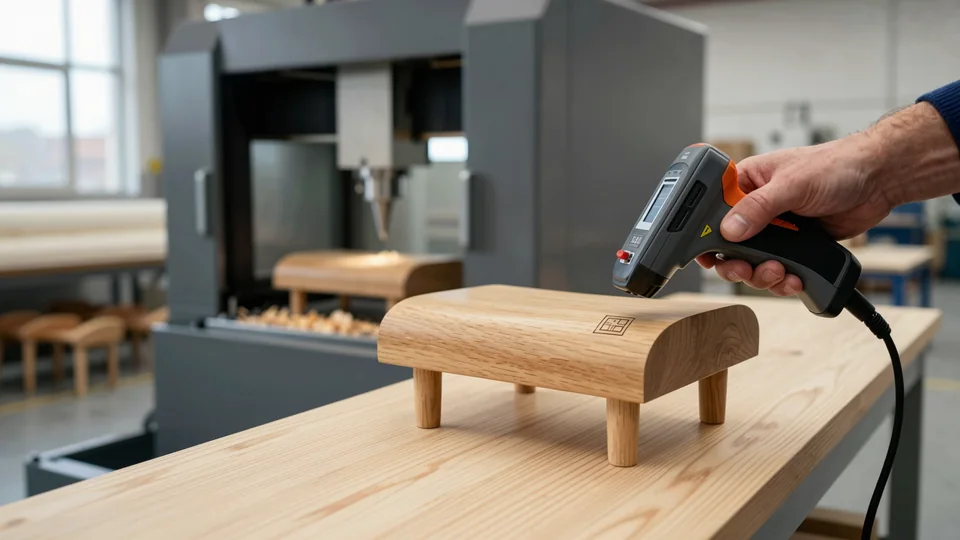

- **Alt text:** The prduct.com QR code laser-etched into the oak
- **Framing:** focus `60% 50%`, question panel left, overlay at 79.2% / 50% (right)
- **Made:** v4: the still is the motion base's own end frame (tools/rig.py), composited from the same layers the clip moves - lounge master photo, the chair's real parts cut from it (SAM 2.1 + BiRefNet), plates made with Z-Image-Turbo / Qwen-Image-Edit, the oak macro and the prduct.com QR burn
- **Source:** `work/v4/bases/T8_first.png`
- **Files:** master `journey-media/final/furniture/data.png`; web 4 files (`journey/media/furniture/data-1920.avif` …), 1920 AVIF 121 KB
- **Questions:** `Q:data.location`, `Q:data.retrieval`, `Q:sourcing.pdf`, `Q:sales.hours`, `Q:data.owner`

### FUR-M08 · Data → Passport

[▶ journey/media/furniture/data-passport-540-h264.mp4](../../journey/media/furniture/data-passport-540-h264.mp4) — `FUR-S08` → `FUR-S09`

- **Timing:** 97 frames · 24 fps · 4.042 s · question cue at 80%
- **Made:** v4: 2.5D layer animation (real object and camera motion: parts float apart, the leg frame glides, turns, travels and lands, the chair flies; laser raster reveal) rendered by LTX-2.5 video-to-video at denoise 0.975 with BOTH end stills as guides (frame 0 and the last frame)
- **Move:** `T8` · scene `work/v4/scenes/T8_data-passport.json` · seed 808 · take `work/v4/clips/T8.mp4`
- **Prompt:** Starting on an extreme macro of a square code laser-etched into oak grain, the camera pulls smoothly back and turns to reveal that the code is on the oak side rail of a lounge armchair with cream cushions in a bright Scandinavian living room; a person's hand holding a dark smartphone moves in from the right and holds the phone up toward the chair, its screen showing the camera view. Photorealistic, premium Nordic product cinematography, real optical depth of field, natural motion blur, steady and smooth, one continuous shot, no cuts, no text.
- **Files:** master `journey-media/final/furniture/data-passport.mp4`; web 4 files, 1080 AV1 1903 KB

### FUR-S09 · Passport

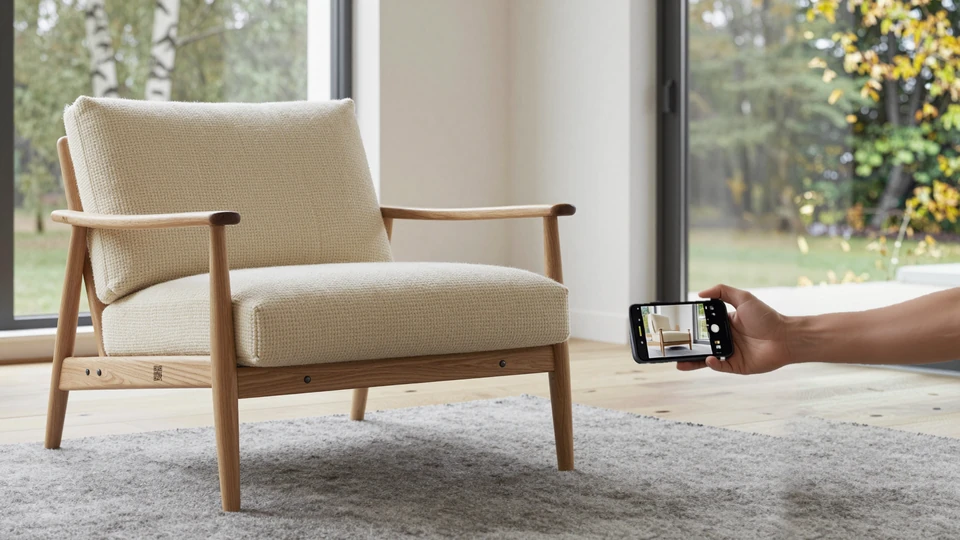

- **Alt text:** A phone scans the QR code on the chair's oak side rail
- **Framing:** focus `30% 60%`, question panel right, overlay at 16.4% / 69.1% (auto)
- **Made:** v4: the still is the motion base's own end frame (tools/rig.py), composited from the same layers the clip moves - lounge master photo, the chair's real parts cut from it (SAM 2.1 + BiRefNet), plates made with Z-Image-Turbo / Qwen-Image-Edit, the oak macro and the prduct.com QR burn
- **Source:** `work/v4/bases/T9_first.png`
- **Files:** master `journey-media/final/furniture/passport.png`; web 4 files (`journey/media/furniture/passport-1920.avif` …), 1920 AVIF 168 KB
- **Questions:** `Q:sales.unbid`, `Q:passport.carrier`, `Q:regulation.scope`

> **REFINE** — On 16:10 screens the scanning hand sits partly behind the question panel (fully visible on 16:9).

### FUR-M09 · Passport → Next life

[▶ journey/media/furniture/passport-nextLife-540-h264.mp4](../../journey/media/furniture/passport-nextLife-540-h264.mp4) — `FUR-S09` → `FUR-S10`

- **Timing:** 97 frames · 24 fps · 4.042 s · question cue at 80%
- **Made:** v4: 2.5D layer animation (real object and camera motion: parts float apart, the leg frame glides, turns, travels and lands, the chair flies; laser raster reveal) rendered by LTX-2.5 video-to-video at denoise 0.975 with BOTH end stills as guides (frame 0 and the last frame)
- **Move:** `T9` · scene `work/v4/scenes/T9_passport-nextLife.json` · seed 909 · take `work/v4/clips/T9_c.mp4`
- **Prompt:** The hand with the phone withdraws; the oak lounge armchair lifts gently off the grey rug and floats in the air, then the camera whips fast to the right, following the floating chair through a streak of motion blur into a bright furniture repair workshop, where the chair glides down and settles softly on a long oak workbench next to a craftsperson in a canvas apron. Photorealistic, premium Nordic product cinematography, real optical depth of field, natural motion blur, steady and smooth, one continuous shot, no cuts, no text.
- **Files:** master `journey-media/final/furniture/passport-nextLife.mp4`; web 4 files, 1080 AV1 1470 KB

### FUR-S10 · Next life

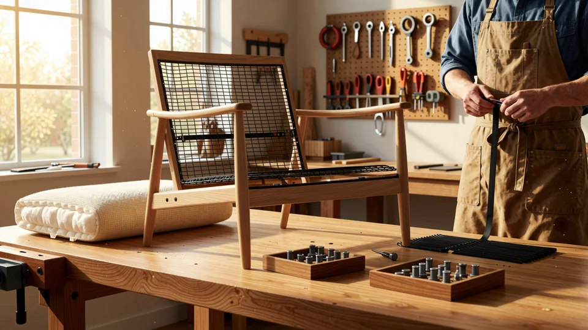

- **Alt text:** The chair on the bench of a repair and upholstery workshop
- **Framing:** focus `45% 55%`, question panel left
- **Made:** v4: the still is the motion base's own end frame (tools/rig.py), composited from the same layers the clip moves - lounge master photo, the chair's real parts cut from it (SAM 2.1 + BiRefNet), plates made with Z-Image-Turbo / Qwen-Image-Edit, the oak macro and the prduct.com QR burn
- **Source:** `work/v4/bases/T9_last.png`
- **Files:** master `journey-media/final/furniture/nextLife.png`; web 4 files (`journey/media/furniture/nextLife-1920.avif` …), 1920 AVIF 74 KB
- **Questions:** `Q:nextLife.continuity`, `Q:nextLife.unlock`

> **CHECK** — The chair lands slightly small on the workbench; the craftsperson is generated.

## Battery & e-mobility · E-bike battery (BAT)

| Stop | Still | Questions here | Move to next |
|---|---|---|---|
| 01 Company | `BAT-S01` | — | `BAT-M01` |
| 02 Product | `BAT-S02` | `Q:product.perspective` `Q:product.identity` | `BAT-M02` |
| 03 Material | `BAT-S03` | `Q:material.composition` | `BAT-M03` |
| 04 Component | `BAT-S04` | `Q:component.bom` | `BAT-M04` |
| 05 Supplier | `BAT-S05` | `Q:supplier.proof` `Q:supplier.trace` | `BAT-M05` |
| 06 Logistics | `BAT-S06` | `Q:logistics.handoff` `Q:logistics.change` | `BAT-M06` |
| 07 Factory | `BAT-S07` | `Q:factory.evidence` | `BAT-M07` |
| 08 Data | `BAT-S08` | `Q:data.location` `Q:data.retrieval` `Q:data.owner` | `BAT-M08` |
| 09 Passport | `BAT-S09` | `Q:passport.carrier` | `BAT-M09` |
| 10 Next life | `BAT-S10` | `Q:nextLife.continuity` `Q:nextLife.unlock` | — |

### BAT-S01 · Company

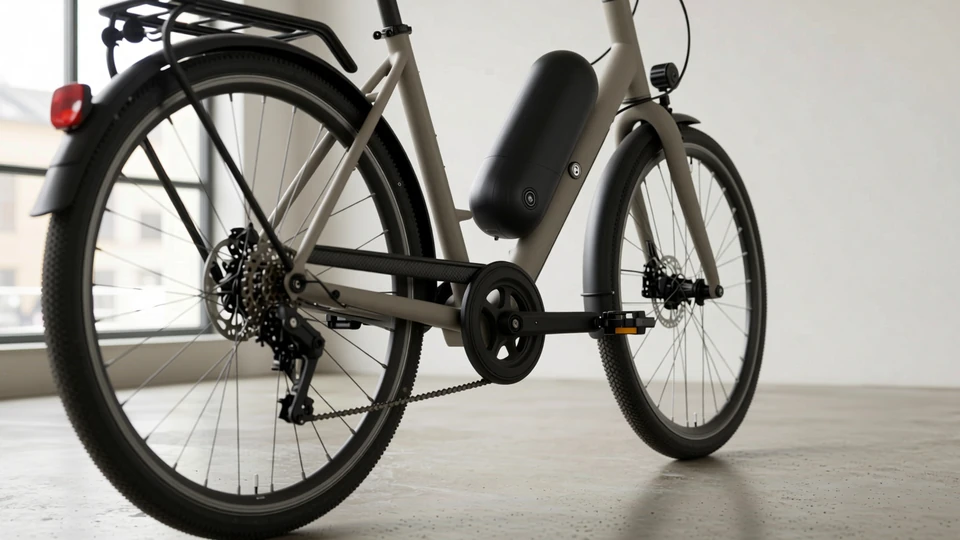

- **Alt text:** Rear three-quarter view of an e-bike with a removable battery
- **Framing:** focus `62% 45%`, question panel left
- **Made:** approved master (Z-Image-Turbo, round 1)
- **Source:** `work/b/b0_rear34_a.png`
- **Files:** master `journey-media/final/battery/company.png`; web 4 files (`journey/media/battery/company-1920.avif` …), 1920 AVIF 59 KB
- **Questions:** none (selector card)

### BAT-M01 · Company → Product

[▶ journey/media/battery/company-product-540-h264.mp4](../../journey/media/battery/company-product-540-h264.mp4) — `BAT-S01` → `BAT-S02`

- **Timing:** 97 frames · 24 fps · 4.042 s · question cue at 80%
- **Made:** single continuous camera move
- **Move:** `battery/company>product`
- **Files:** master `journey-media/final/battery/company-product.mp4`; web 4 files, 1080 AV1 1038 KB

### BAT-S02 · Product

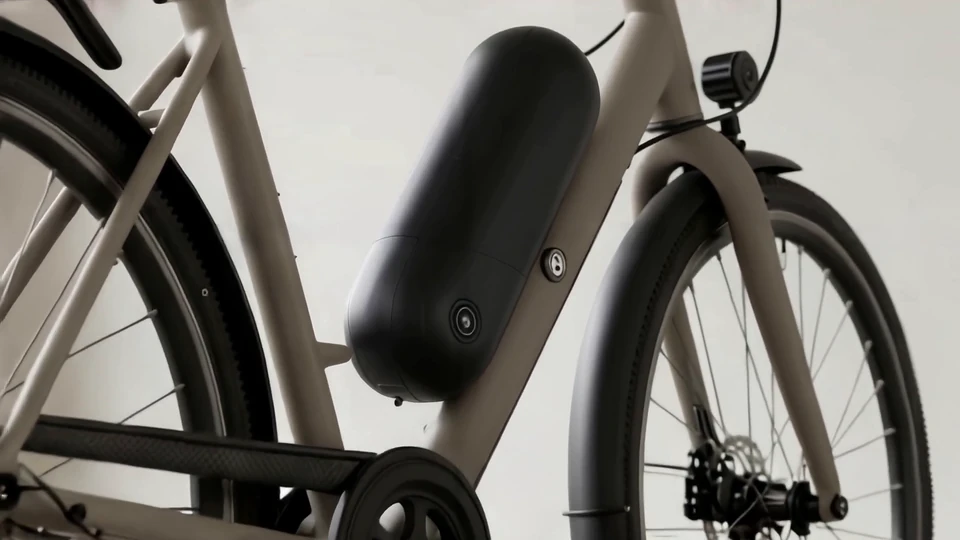

- **Alt text:** The graphite battery pack on the e-bike's down tube, closer
- **Framing:** focus `42% 45%`, question panel right
- **Made:** derived: last frame of the generated camera move battery/company>product
- **Files:** master `journey-media/final/battery/product.png`; web 4 files (`journey/media/battery/product-1920.avif` …), 1920 AVIF 37 KB
- **Questions:** `Q:product.perspective`, `Q:product.identity`

### BAT-M02 · Product → Material

[▶ journey/media/battery/product-material-540-h264.mp4](../../journey/media/battery/product-material-540-h264.mp4) — `BAT-S02` → `BAT-S03`

- **Timing:** 97 frames · 24 fps · 4.042 s · question cue at 80%
- **Made:** single continuous camera move
- **Move:** `battery/product>material`
- **Files:** master `journey-media/final/battery/product-material.mp4`; web 4 files, 1080 AV1 597 KB

### BAT-S03 · Material

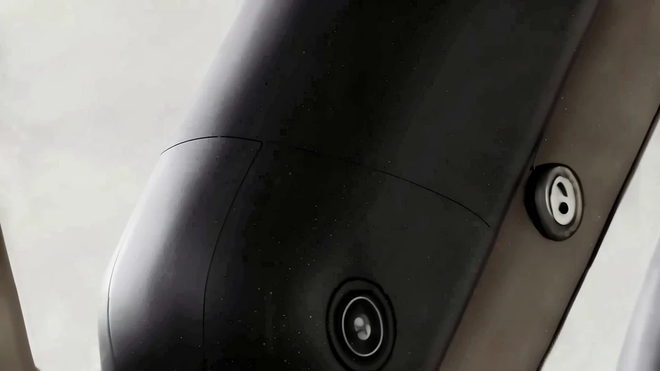

- **Alt text:** Close-up of the battery housing: bead-blasted graphite, a fine seam and the lock
- **Framing:** focus `45% 55%`, question panel right
- **Made:** derived: last frame of the generated camera move battery/product>material
- **Files:** master `journey-media/final/battery/material.png`; web 4 files (`journey/media/battery/material-1920.avif` …), 1920 AVIF 19 KB
- **Questions:** `Q:material.composition`

### BAT-M03 · Material → Component

[▶ journey/media/battery/material-component-540-h264.mp4](../../journey/media/battery/material-component-540-h264.mp4) — `BAT-S03` → `BAT-S04`

- **Timing:** 97 frames · 24 fps · 4.042 s · question cue at 80%
- **Made:** match cut through material on motion: push into A's material, cut at the macro, B's push played in reverse lands on the next anchor
- **Move:** `battery/material@housing + reversed battery/component@housing`
- **Files:** master `journey-media/final/battery/material-component.mp4`; web 4 files, 1080 AV1 1740 KB

### BAT-S04 · Component

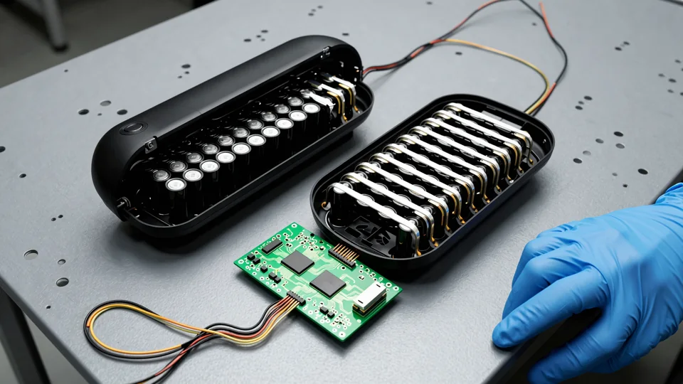

- **Alt text:** The battery opened on a service bench: cells and BMS
- **Framing:** focus `45% 55%`, question panel right
- **Made:** Qwen-Image-Edit-2511 with reference images
- **Prompt:** The same graphite battery pack opened on an ESD-safe grey service bench: the housing halves are separated and laid side by side, inside are neat rows of cylindrical lithium-ion cells in black plastic cell holders joined by bright nickel strips, a green battery-management circuit board with fine wiring and a connector at one end. A technician's blue-gloved hand rests at the edge. Clean workshop light, top-down three-quarter view. Believable service context, no sci-fi. Photorealistic technical photograph, 50mm lens.
- **Source:** `work/anchors/battery/component_q7.png`
- **Files:** master `journey-media/final/battery/component.png`; web 4 files (`journey/media/battery/component-1920.avif` …), 1920 AVIF 107 KB
- **Questions:** `Q:component.bom`

> **REFINE** — The opened pack holds small silver-topped cylindrical cells, while the factory (BAT-S07) shows large black cells. Pick one cell format.

### BAT-M04 · Component → Supplier

[▶ journey/media/battery/component-supplier-540-h264.mp4](../../journey/media/battery/component-supplier-540-h264.mp4) — `BAT-S04` → `BAT-S05`

- **Timing:** 97 frames · 24 fps · 4.042 s · question cue at 80%
- **Made:** match cut through material on motion: push into A's material, cut at the macro, B's push played in reverse lands on the next anchor
- **Move:** `battery/component@cells + reversed battery/supplier@cells`
- **Files:** master `journey-media/final/battery/component-supplier.mp4`; web 4 files, 1080 AV1 2406 KB

### BAT-S05 · Supplier

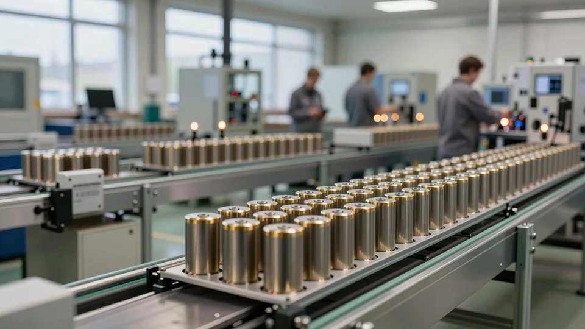

- **Alt text:** Trays of cells on a conveyor in a cell plant
- **Framing:** focus `40% 55%`, question panel right
- **Made:** Z-Image-Turbo text-to-image
- **Prompt:** Inside a clean modern battery cell manufacturing plant in Europe: long trays of identical cylindrical lithium-ion cells moving on a stainless conveyor in the foreground, formation and testing racks with small status lights receding into the background, technicians in grey workwear softly out of focus, cool daylight from high windows mixed with soft LED light, orderly, precise, traceable. Camera at bench height, 35mm lens. Premium Nordic product cinematography, photorealistic, ARRI Alexa 35 look, subtle Cooke lens character, soft northern European daylight, natural contrast, realistic PBR materials, real optical depth of field, restrained luxury, no text, no letters, no logos, no brand marks…
- **Source:** `work/anchors/battery/supplier_z7.png`
- **Files:** master `journey-media/final/battery/supplier.png`; web 4 files (`journey/media/battery/supplier-1920.avif` …), 1920 AVIF 63 KB
- **Questions:** `Q:supplier.proof`, `Q:supplier.trace`

### BAT-M05 · Supplier → Logistics

[▶ journey/media/battery/supplier-logistics-540-h264.mp4](../../journey/media/battery/supplier-logistics-540-h264.mp4) — `BAT-S05` → `BAT-S06`

- **Timing:** 97 frames · 24 fps · 4.042 s · question cue at 80%
- **Made:** match cut through material on motion: push into A's material, cut at the macro, B's push played in reverse lands on the next anchor
- **Move:** `battery/supplier@cells + reversed battery/logistics@box`
- **Files:** master `journey-media/final/battery/supplier-logistics.mp4`; web 4 files, 1080 AV1 1867 KB

### BAT-S06 · Logistics

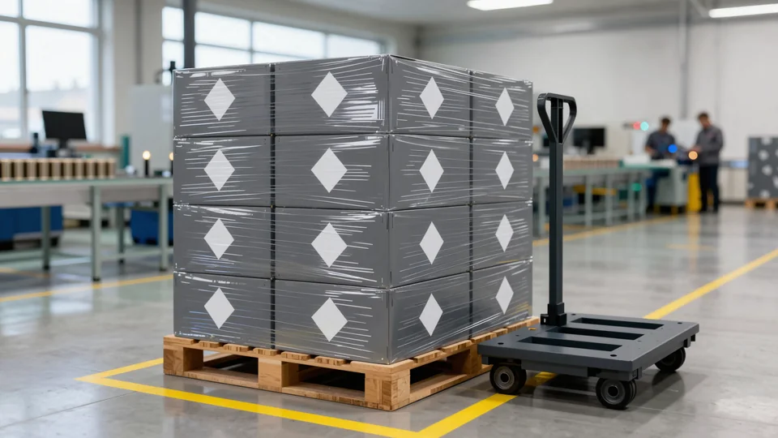

- **Alt text:** Certified shipping boxes on a pallet in a dispatch area
- **Framing:** focus `45% 55%`, question panel right
- **Made:** Qwen-Image-Edit-2511 with reference images
- **Prompt:** In the same battery plant, the camera has moved to the controlled dispatch area: plain grey sealed shipping boxes for lithium-ion cells stacked on a wooden pallet and neatly stretch-wrapped, each box with one small plain white diamond-shaped label that is completely blank, a graphite pallet truck beside it, a simple painted yellow safety outline on the clean floor. Absolutely no text, letters, numbers, symbols, signs or floor lettering anywhere. The conveyor from before is softly visible behind. Same light. Photorealistic industrial photograph, 35mm lens.
- **Source:** `work/anchors/battery/logistics_q19.png`
- **Files:** master `journey-media/final/battery/logistics.png`; web 4 files (`journey/media/battery/logistics-1920.avif` …), 1920 AVIF 69 KB
- **Questions:** `Q:logistics.handoff`, `Q:logistics.change`

> **CHECK** — Pallet hazard diamonds are blank (generated images avoid text; a real class-9 lithium label carries a symbol).

### BAT-M06 · Logistics → Factory

[▶ journey/media/battery/logistics-factory-540-h264.mp4](../../journey/media/battery/logistics-factory-540-h264.mp4) — `BAT-S06` → `BAT-S07`

- **Timing:** 97 frames · 24 fps · 4.042 s · question cue at 80%
- **Made:** match cut through material on motion: push into A's material, cut at the macro, B's push played in reverse lands on the next anchor
- **Move:** `battery/logistics@box + reversed battery/factory@cells`
- **Files:** master `journey-media/final/battery/logistics-factory.mp4`; web 4 files, 1080 AV1 1847 KB

### BAT-S07 · Factory

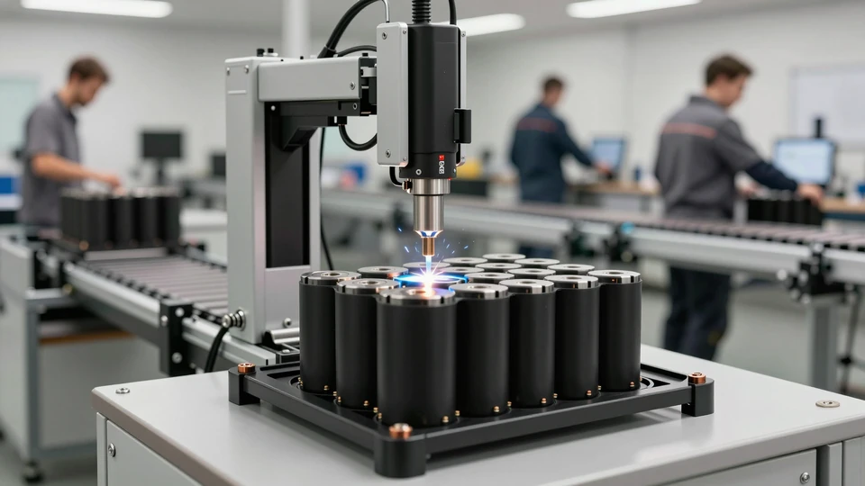

- **Alt text:** A welding station on a battery pack assembly line
- **Framing:** focus `40% 55%`, question panel right
- **Made:** Z-Image-Turbo text-to-image
- **Prompt:** Inside a modern European e-bike battery pack assembly line: in the foreground an automated spot-welding station joining bright nickel strips onto a module of cylindrical cells in a black holder, graphite-black battery housings waiting on a conveyor, operators in grey workwear softly out of focus, clean white and grey hall, soft daylight and LED light. Camera at bench height, 35mm lens. Premium Nordic product cinematography, photorealistic, ARRI Alexa 35 look, subtle Cooke lens character, soft northern European daylight, natural contrast, realistic PBR materials, real optical depth of field, restrained luxury, no text, no letters, no logos, no brand marks, no watermark.
- **Source:** `work/anchors/battery/factory_z7.png`
- **Files:** master `journey-media/final/battery/factory.png`; web 4 files (`journey/media/battery/factory-1920.avif` …), 1920 AVIF 47 KB
- **Questions:** `Q:factory.evidence`

> **REFINE** — Large black cylindrical cells under the laser head do not match the pack's cells in BAT-S04.

### BAT-M07 · Factory → Data

[▶ journey/media/battery/factory-data-540-h264.mp4](../../journey/media/battery/factory-data-540-h264.mp4) — `BAT-S07` → `BAT-S08`

- **Timing:** 97 frames · 24 fps · 4.042 s · question cue at 80%
- **Made:** v4 data stop: 2.5D layer move (push into / pull back from the product's own surface; battery: the laser raster burns the code in) rendered by LTX-2.5 video-to-video at denoise 0.975 with both end stills as guides
- **Move:** `B7` · scene `work/v4b/scenes/B7_factory-data.json` · seed 1707 · take `work/v4/clips/B7.mp4`
- **Prompt:** The camera pushes smoothly down toward the block of black battery cells under the laser head and into the matte black surface of a cell; the tiny bright point of the laser races across it row by row and marks a light grey square code into the black surface, until the freshly marked code fills the frame. Photorealistic, premium Nordic product cinematography, real optical depth of field, natural motion blur, steady and smooth, one continuous shot, no cuts, no text.
- **Files:** master `journey-media/final/battery/factory-data.mp4`; web 4 files, 1080 AV1 1459 KB

> **CHECK** — The laser raster reads mostly as a focus pull onto the code.

### BAT-S08 · Data

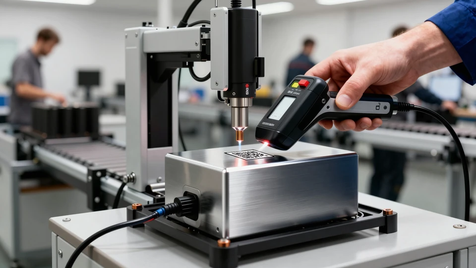

- **Alt text:** The prduct.com QR code laser-marked into the battery pack's black casing
- **Framing:** focus `60% 50%`, question panel left, overlay at 79.2% / 50% (right)
- **Made:** v4 data macro: Z-Image-Turbo surface texture (matte black pack polymer) with the real HTTPS://PRDUCT.COM QR (tools/data_v4b.py)
- **Prompt:** In the same battery assembly hall, the camera has moved to the end-of-line test station: a finished graphite-black battery pack, identical to the one on the e-bike, lies on the test bench connected to a diagnostic cable; a worker's hand holds a handheld scanner over a small laser-etched square data matrix code on the aluminium housing. There are no monitors, screens or displays anywhere in the frame, only machines, cables and the blurred assembly line behind. Focus on the code and the scanner. Photorealistic industrial photograph, 50mm lens.
- **Source:** `work/anchors/battery/data_q31.png`
- **Files:** master `journey-media/final/battery/data.png`; web 4 files (`journey/media/battery/data-1920.avif` …), 1920 AVIF 332 KB
- **Questions:** `Q:data.location`, `Q:data.retrieval`, `Q:data.owner`

> **OK** — Remade 2026-09-28: macro of the pack's own black casing with the laser-marked prduct.com QR (light on dark; decodes).

### BAT-M08 · Data → Passport

[▶ journey/media/battery/data-passport-540-h264.mp4](../../journey/media/battery/data-passport-540-h264.mp4) — `BAT-S08` → `BAT-S09`

- **Timing:** 97 frames · 24 fps · 4.042 s · question cue at 80%
- **Made:** v4 data stop: 2.5D layer move (push into / pull back from the product's own surface; battery: the laser raster burns the code in) rendered by LTX-2.5 video-to-video at denoise 0.975 with both end stills as guides
- **Move:** `B8` · scene `work/v4b/scenes/B8_data-passport.json` · seed 1808 · take `work/v4/clips/B8.mp4`
- **Prompt:** Starting on an extreme macro of a light grey square code laser-marked into matte black plastic, the camera pulls smoothly back and turns to reveal that the code is on the black battery pack of an e-bike on a workstand in a bright workshop; a hand holds a dark smartphone up toward the code. Photorealistic, premium Nordic product cinematography, real optical depth of field, natural motion blur, steady and smooth, one continuous shot, no cuts, no text.
- **Files:** master `journey-media/final/battery/data-passport.mp4`; web 4 files, 1080 AV1 1468 KB

### BAT-S09 · Passport

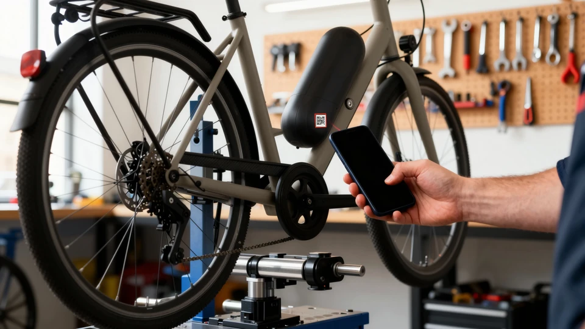

- **Alt text:** A mechanic's phone at the QR code marked on the bike's battery
- **Framing:** focus `50% 50%`, question panel left, overlay at 54.8% / 36.6% (auto)
- **Made:** Qwen-Image-Edit-2511 with reference images
- **Prompt:** The same e-bike in a bright, calm bicycle service workshop, clamped in a repair stand. A mechanic's hand holds a dark smartphone close to a small laser-etched square code on the graphite battery housing on the down tube; the phone screen is dark. Tools hang on a pegboard wall behind, soft daylight, shallow depth of field with focus on the battery and the phone. Not a commercial, a real working moment. Photorealistic editorial photograph, 50mm lens.
- **Source:** `work/anchors/battery/passport_q7.png`
- **Files:** master `journey-media/final/battery/passport.png`; web 4 files (`journey/media/battery/passport-1920.avif` …), 1920 AVIF 69 KB
- **Questions:** `Q:passport.carrier`

> **OK** — Remade 2026-09-28: paper label and red scanner beam removed; the same code is laser-marked on the pack.

### BAT-M09 · Passport → Next life

[▶ journey/media/battery/passport-nextLife-540-h264.mp4](../../journey/media/battery/passport-nextLife-540-h264.mp4) — `BAT-S09` → `BAT-S10`

- **Timing:** 97 frames · 24 fps · 4.042 s · question cue at 80%
- **Made:** match cut through material on motion: push into A's material, cut at the macro, B's push played in reverse lands on the next anchor
- **Move:** `battery/passport@housing + reversed battery/nextLife@housing`
- **Files:** master `journey-media/final/battery/passport-nextLife.mp4`; web 4 files, 1080 AV1 1903 KB

### BAT-S10 · Next life

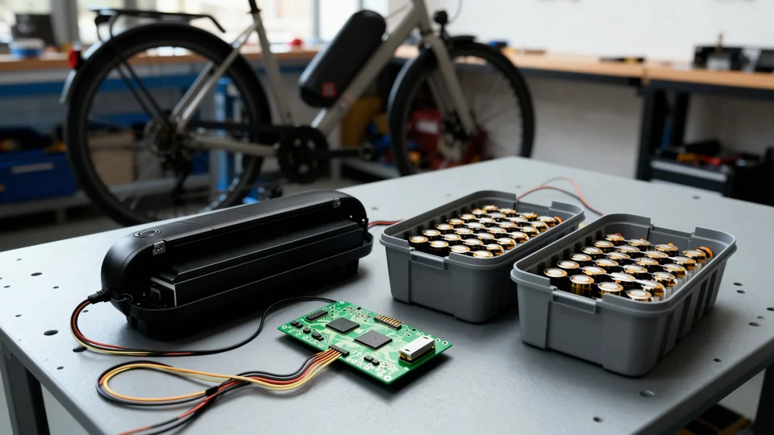

- **Alt text:** The removed battery on a state-of-health tester, modules sorted for reuse
- **Framing:** focus `45% 55%`, question panel right
- **Made:** Qwen-Image-Edit-2511 with reference images
- **Prompt:** In the same service workshop, the battery has been removed from the e-bike: the graphite battery pack lies on the workbench connected by a cable to a compact state-of-health tester, and beside it an opened older pack shows its cell modules carefully sorted into two plain grey crates, one for second-life reuse and one for recycling, without any text. The e-bike stands softly out of focus in the background. Calm industrial daylight. Photorealistic editorial photograph, 35mm lens.
- **Source:** `work/anchors/battery/nextLife_q7.png`
- **Files:** master `journey-media/final/battery/nextLife.png`; web 4 files (`journey/media/battery/nextLife-1920.avif` …), 1920 AVIF 72 KB
- **Questions:** `Q:nextLife.continuity`, `Q:nextLife.unlock`

## Textiles & apparel · Rain jacket (TEX)

| Stop | Still | Questions here | Move to next |
|---|---|---|---|
| 01 Company | `TEX-S01` | — | `TEX-M01` |
| 02 Product | `TEX-S02` | `Q:product.perspective` `Q:product.identity` | `TEX-M02` |
| 03 Material | `TEX-S03` | `Q:material.composition` | `TEX-M03` |
| 04 Component | `TEX-S04` | `Q:component.bom` | `TEX-M04` |
| 05 Supplier | `TEX-S05` | `Q:supplier.proof` `Q:supplier.trace` | `TEX-M05` |
| 06 Logistics | `TEX-S06` | `Q:logistics.handoff` `Q:logistics.change` | `TEX-M06` |
| 07 Factory | `TEX-S07` | `Q:factory.evidence` | `TEX-M07` |
| 08 Data | `TEX-S08` | `Q:data.location` `Q:data.retrieval` `Q:data.owner` | `TEX-M08` |
| 09 Passport | `TEX-S09` | `Q:passport.carrier` | `TEX-M09` |
| 10 Next life | `TEX-S10` | `Q:nextLife.continuity` `Q:nextLife.unlock` | — |

### TEX-S01 · Company

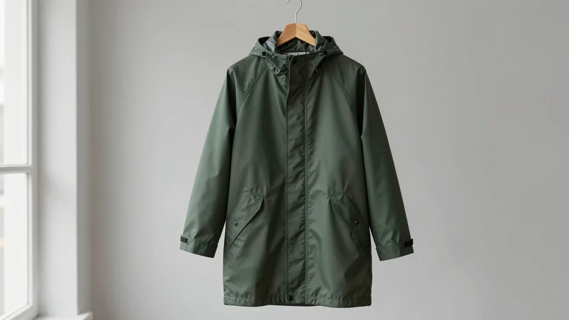

- **Alt text:** A Danish rain jacket hanging against a plaster wall
- **Framing:** focus `50% 40%`, question panel right
- **Made:** approved master (Z-Image-Turbo, round 1)
- **Source:** `work/masters/textile_t0_s11.png`
- **Files:** master `journey-media/final/textile/company.png`; web 4 files (`journey/media/textile/company-1920.avif` …), 1920 AVIF 24 KB
- **Questions:** none (selector card)

### TEX-M01 · Company → Product

[▶ journey/media/textile/company-product-540-h264.mp4](../../journey/media/textile/company-product-540-h264.mp4) — `TEX-S01` → `TEX-S02`

- **Timing:** 97 frames · 24 fps · 4.042 s · question cue at 80%
- **Made:** single continuous camera move
- **Move:** `textile/company>product`
- **Files:** master `journey-media/final/textile/company-product.mp4`; web 4 files, 1080 AV1 400 KB

### TEX-S02 · Product

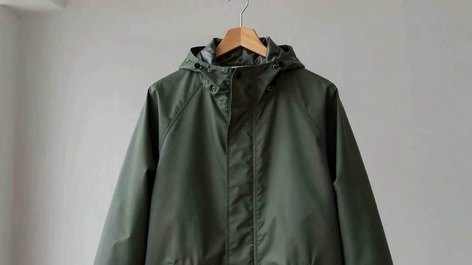

- **Alt text:** The rain jacket's shoulders, hood and collar on its hanger
- **Framing:** focus `45% 35%`, question panel right
- **Made:** derived: last frame of the generated camera move textile/company>product
- **Files:** master `journey-media/final/textile/product.png`; web 4 files (`journey/media/textile/product-1920.avif` …), 1920 AVIF 21 KB
- **Questions:** `Q:product.perspective`, `Q:product.identity`

### TEX-M02 · Product → Material

[▶ journey/media/textile/product-material-540-h264.mp4](../../journey/media/textile/product-material-540-h264.mp4) — `TEX-S02` → `TEX-S03`

- **Timing:** 97 frames · 24 fps · 4.042 s · question cue at 80%
- **Made:** single continuous camera move
- **Move:** `textile/product>material`
- **Files:** master `journey-media/final/textile/product-material.mp4`; web 4 files, 1080 AV1 438 KB

### TEX-S03 · Material

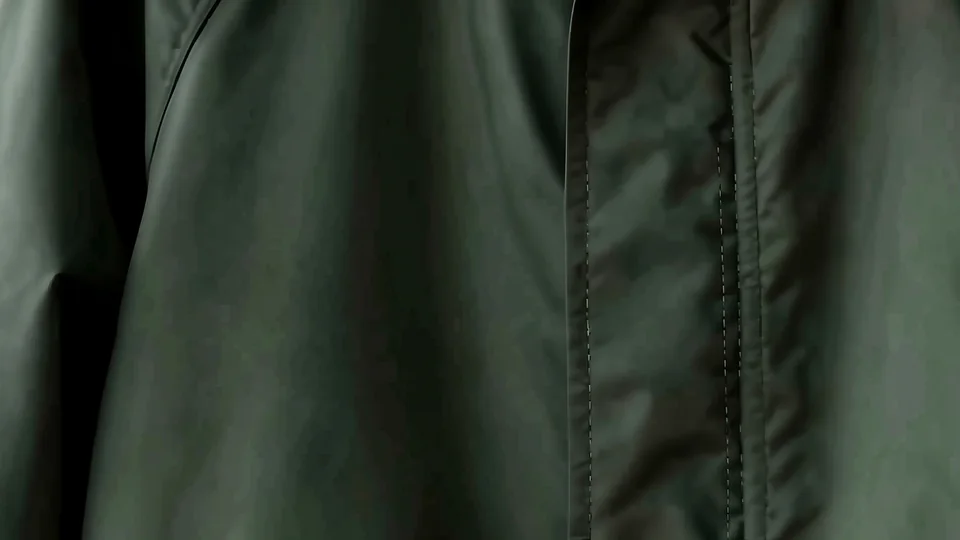

- **Alt text:** Macro of the matte coated waterproof fabric
- **Framing:** focus `50% 50%`, question panel right
- **Made:** derived: last frame of the generated camera move textile/product>material
- **Files:** master `journey-media/final/textile/material.png`; web 4 files (`journey/media/textile/material-1920.avif` …), 1920 AVIF 17 KB
- **Questions:** `Q:material.composition`

### TEX-M03 · Material → Component

[▶ journey/media/textile/material-component-540-h264.mp4](../../journey/media/textile/material-component-540-h264.mp4) — `TEX-S03` → `TEX-S04`

- **Timing:** 97 frames · 24 fps · 4.042 s · question cue at 80%
- **Made:** match cut through material on motion: push into A's material, cut at the macro, B's push played in reverse lands on the next anchor
- **Move:** `textile/material@fabric + reversed textile/component@fabric`
- **Files:** master `journey-media/final/textile/material-component.mp4`; web 4 files, 1080 AV1 1036 KB

### TEX-S04 · Component

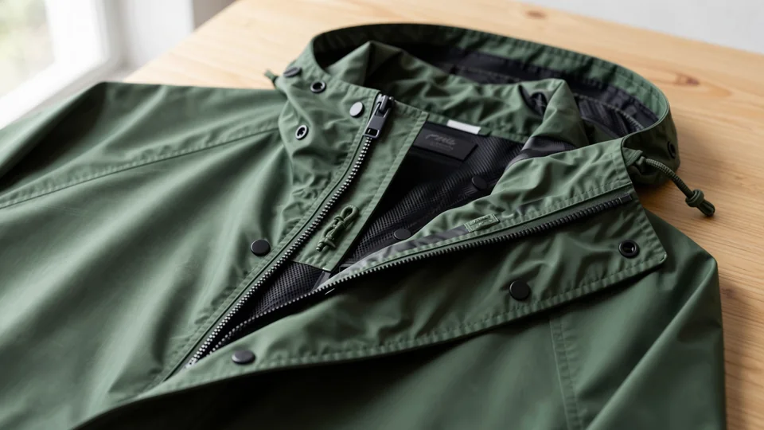

- **Alt text:** Zip, seam tape, studs and lining of the opened jacket
- **Framing:** focus `45% 55%`, question panel right
- **Made:** Qwen-Image-Edit-2511 with reference images
- **Prompt:** Close-up of the front opening of this same rain jacket laid on a pale oak table with one front panel folded back: the matte black zipper teeth, the placket with matte black press studs, the narrow heat-sealed seam tape on the inside of the seams, the mesh lining, a small drawcord toggle — the multi-layer construction clearly readable. No labels, no tags, no printed text anywhere. Soft daylight from the left, shallow depth of field. Photorealistic product detail photograph, 50mm lens.
- **Source:** `work/anchors/textile/component_q19.png`
- **Files:** master `journey-media/final/textile/component.png`; web 4 files (`journey/media/textile/component-1920.avif` …), 1920 AVIF 59 KB
- **Questions:** `Q:component.bom`

> **REFINE** — This jacket (zip, black lining, lying on a table) is not the long press-stud coat of TEX-S01, S02 and S09.

### TEX-M04 · Component → Supplier

[▶ journey/media/textile/component-supplier-540-h264.mp4](../../journey/media/textile/component-supplier-540-h264.mp4) — `TEX-S04` → `TEX-S05`

- **Timing:** 97 frames · 24 fps · 4.042 s · question cue at 80%
- **Made:** match cut through material on motion: push into A's material, cut at the macro, B's push played in reverse lands on the next anchor
- **Move:** `textile/component@fabric + reversed textile/supplier@fabric`
- **Files:** master `journey-media/final/textile/component-supplier.mp4`; web 4 files, 1080 AV1 1169 KB

### TEX-S05 · Supplier

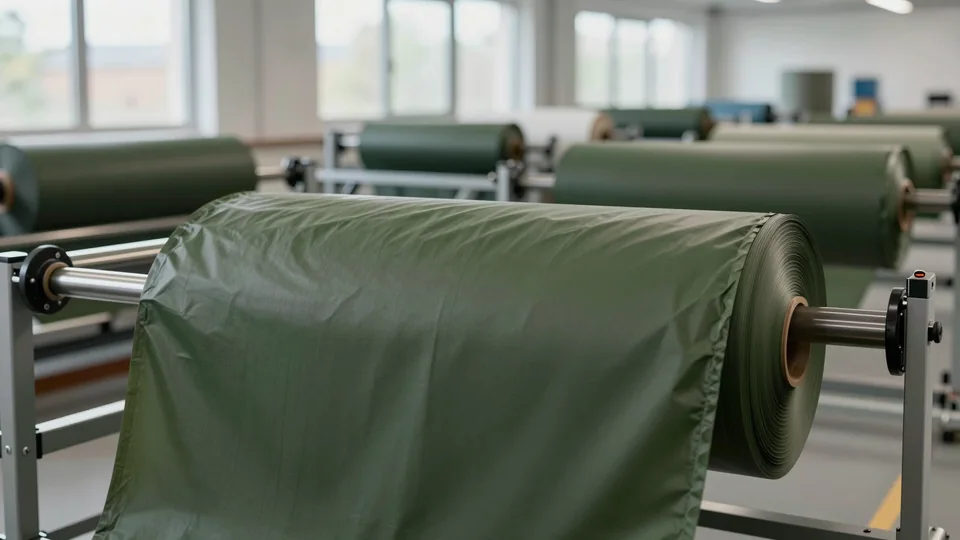

- **Alt text:** A roll of the same fabric in a technical textile mill
- **Framing:** focus `40% 55%`, question panel right
- **Made:** Z-Image-Turbo text-to-image
- **Prompt:** Inside a clean modern European technical textile mill: in the foreground a large roll of dark moss-green coated waterproof fabric on an inspection frame, the fabric running smoothly over polished rollers towards the camera, a coating line and more fabric rolls softly out of focus in the background, high windows with soft daylight, orderly and precise. Camera at chest height, 35mm lens. Premium Nordic product cinematography, photorealistic, ARRI Alexa 35 look, subtle Cooke lens character, soft northern European daylight, natural contrast, realistic PBR materials, real optical depth of field, restrained luxury, no text, no letters, no logos, no brand marks, no watermark.
- **Source:** `work/anchors/textile/supplier_z7.png`
- **Files:** master `journey-media/final/textile/supplier.png`; web 4 files (`journey/media/textile/supplier-1920.avif` …), 1920 AVIF 39 KB
- **Questions:** `Q:supplier.proof`, `Q:supplier.trace`

### TEX-M05 · Supplier → Logistics

[▶ journey/media/textile/supplier-logistics-540-h264.mp4](../../journey/media/textile/supplier-logistics-540-h264.mp4) — `TEX-S05` → `TEX-S06`

- **Timing:** 97 frames · 24 fps · 4.042 s · question cue at 80%
- **Made:** match cut through material on motion: push into A's material, cut at the macro, B's push played in reverse lands on the next anchor
- **Move:** `textile/supplier@fabric + reversed textile/logistics@roll`
- **Files:** master `journey-media/final/textile/supplier-logistics.mp4`; web 4 files, 1080 AV1 2018 KB

### TEX-S06 · Logistics

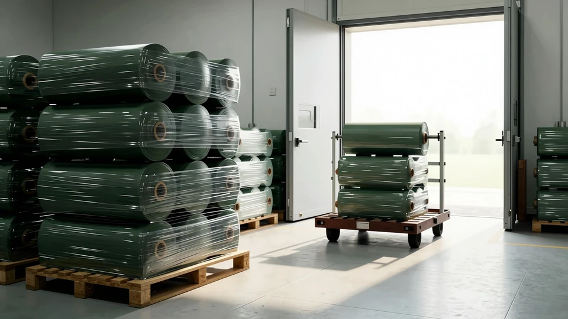

- **Alt text:** Wrapped fabric rolls on pallets at dispatch
- **Framing:** focus `45% 55%`, question panel right
- **Made:** Qwen-Image-Edit-2511 with reference images
- **Prompt:** In the same textile mill, the camera has moved to the dispatch area: finished rolls of the same dark moss-green fabric wrapped in clear film are stacked on wooden pallets, one pallet on a pallet truck heading to an open loading door with soft daylight, orderly and clean. Same light. Photorealistic industrial photograph, 35mm lens.
- **Source:** `work/anchors/textile/logistics_q7.png`
- **Files:** master `journey-media/final/textile/logistics.png`; web 4 files (`journey/media/textile/logistics-1920.avif` …), 1920 AVIF 80 KB
- **Questions:** `Q:logistics.handoff`, `Q:logistics.change`

### TEX-M06 · Logistics → Factory

[▶ journey/media/textile/logistics-factory-540-h264.mp4](../../journey/media/textile/logistics-factory-540-h264.mp4) — `TEX-S06` → `TEX-S07`

- **Timing:** 97 frames · 24 fps · 4.042 s · question cue at 80%
- **Made:** match cut through material on motion: push into A's material, cut at the macro, B's push played in reverse lands on the next anchor
- **Move:** `textile/logistics@roll + reversed textile/factory@fabric`
- **Files:** master `journey-media/final/textile/logistics-factory.mp4`; web 4 files, 1080 AV1 2364 KB

### TEX-S07 · Factory

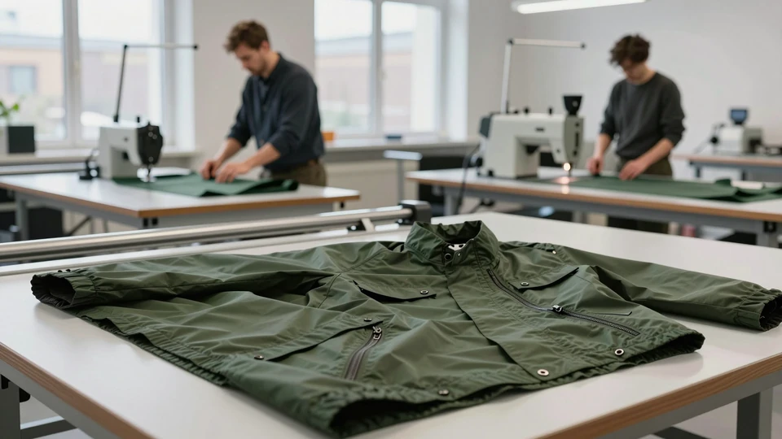

- **Alt text:** Jacket panels being cut in a garment workshop
- **Framing:** focus `40% 55%`, question panel right
- **Made:** Z-Image-Turbo text-to-image
- **Prompt:** Inside a bright modern European garment workshop: in the foreground an automated cutting table cutting jacket panels from dark moss-green coated waterproof fabric, cut panels neatly stacked, behind it a seam-sealing machine applying tape to a seam and a sewing station, soft daylight from tall windows, skilled operators softly out of focus, calm and precise. Camera at chest height, 35mm lens. Premium Nordic product cinematography, photorealistic, ARRI Alexa 35 look, subtle Cooke lens character, soft northern European daylight, natural contrast, realistic PBR materials, real optical depth of field, restrained luxury, no text, no letters, no logos, no brand marks, no watermark.
- **Source:** `work/anchors/textile/factory_z7.png`
- **Files:** master `journey-media/final/textile/factory.png`; web 4 files (`journey/media/textile/factory-1920.avif` …), 1920 AVIF 58 KB
- **Questions:** `Q:factory.evidence`

> **REFINE** — The factory jacket (short, flap pockets, zips) differs from the product coat.

### TEX-M07 · Factory → Data

[▶ journey/media/textile/factory-data-540-h264.mp4](../../journey/media/textile/factory-data-540-h264.mp4) — `TEX-S07` → `TEX-S08`

- **Timing:** 97 frames · 24 fps · 4.042 s · question cue at 80%
- **Made:** v4 data stop: 2.5D layer move (push into / pull back from the product's own surface; battery: the laser raster burns the code in) rendered by LTX-2.5 video-to-video at denoise 0.975 with both end stills as guides
- **Move:** `X7` · scene `work/v4b/scenes/X7_factory-data.json` · seed 2707 · take `work/v4/clips/X7_b.mp4`
- **Prompt:** The camera pushes smoothly down toward the green rain jacket lying on the cutting table and into its white care label inside the collar, until the woven label with its printed square code fills the frame. One continuous camera move. Photorealistic, premium Nordic product cinematography, real optical depth of field, natural motion blur, steady and smooth, one continuous shot, no cuts, no text.
- **Files:** master `journey-media/final/textile/factory-data.mp4`; web 4 files, 1080 AV1 1149 KB

### TEX-S08 · Data

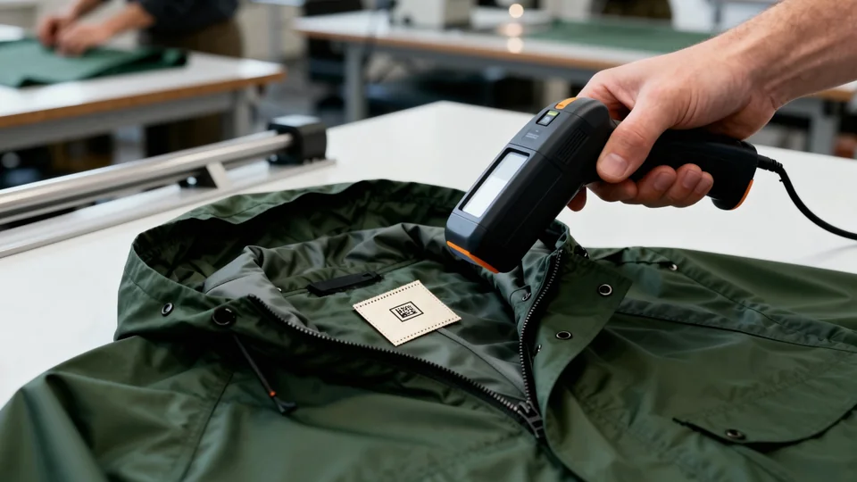

- **Alt text:** The prduct.com QR code printed on the jacket's woven care label
- **Framing:** focus `60% 50%`, question panel left, overlay at 79.2% / 50% (right)
- **Made:** v4 data macro: Z-Image-Turbo surface texture (woven care label) with the real HTTPS://PRDUCT.COM QR (tools/data_v4b.py)
- **Prompt:** In the same garment workshop, the camera has moved to the final inspection table: the finished dark moss-green rain jacket, identical to the hanging one, lies flat with its inside neck visible; a small woven care label with a tiny square code is sewn inside, and a worker's hand holds a handheld scanner over it. No readable text anywhere. Focus on the label and the scanner. Photorealistic industrial photograph, 50mm lens.
- **Source:** `work/anchors/textile/data_q7.png`
- **Files:** master `journey-media/final/textile/data.png`; web 4 files (`journey/media/textile/data-1920.avif` …), 1920 AVIF 97 KB
- **Questions:** `Q:data.location`, `Q:data.retrieval`, `Q:data.owner`

> **OK** — Remade 2026-09-28: macro of the woven care label with the printed prduct.com QR, sewn in the collar.

### TEX-M08 · Data → Passport

[▶ journey/media/textile/data-passport-540-h264.mp4](../../journey/media/textile/data-passport-540-h264.mp4) — `TEX-S08` → `TEX-S09`

- **Timing:** 97 frames · 24 fps · 4.042 s · question cue at 80%
- **Made:** v4 data stop: 2.5D layer move (push into / pull back from the product's own surface; battery: the laser raster burns the code in) rendered by LTX-2.5 video-to-video at denoise 0.975 with both end stills as guides
- **Move:** `X8` · scene `work/v4b/scenes/X8_data-passport.json` · seed 2808 · take `work/v4/clips/X8_b.mp4`
- **Prompt:** Starting on an extreme macro of a square code printed on a white woven care label, the camera pulls smoothly back to reveal the label inside the collar of a green rain jacket on a hanger in a bright room, while a hand holds a dark smartphone up toward it. Photorealistic, premium Nordic product cinematography, real optical depth of field, natural motion blur, steady and smooth, one continuous shot, no cuts, no text.
- **Files:** master `journey-media/final/textile/data-passport.mp4`; web 4 files, 1080 AV1 891 KB

### TEX-S09 · Passport

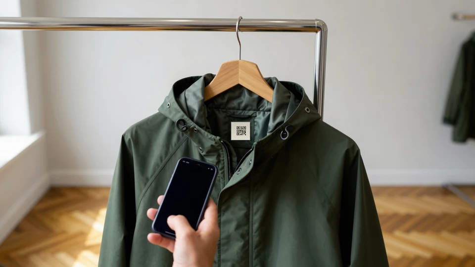

- **Alt text:** A customer's phone at the QR code on the jacket's collar label
- **Framing:** focus `50% 45%`, question panel left, overlay at 50.8% / 48.9% (auto)
- **Made:** Qwen-Image-Edit-2511 with reference images
- **Prompt:** The same rain jacket hanging on a slim steel rail in a minimalist Copenhagen store with pale plaster walls and oak floor. A customer's hand holding a dark smartphone approaches the small woven label with a tiny square code at the inside of the collar; the phone screen is dark. Soft daylight, shallow depth of field, focus on the collar and the phone. Photorealistic editorial photograph, 50mm lens.
- **Source:** `work/anchors/textile/passport_q7.png`
- **Files:** master `journey-media/final/textile/passport.png`; web 4 files (`journey/media/textile/passport-1920.avif` …), 1920 AVIF 33 KB
- **Questions:** `Q:passport.carrier`

> **OK** — Remade 2026-09-28: the collar label is the off-white weave of the data macro.

### TEX-M09 · Passport → Next life

[▶ journey/media/textile/passport-nextLife-540-h264.mp4](../../journey/media/textile/passport-nextLife-540-h264.mp4) — `TEX-S09` → `TEX-S10`

- **Timing:** 97 frames · 24 fps · 4.042 s · question cue at 80%
- **Made:** match cut through material on motion: push into A's material, cut at the macro, B's push played in reverse lands on the next anchor
- **Move:** `textile/passport@fabric + reversed textile/nextLife@fabric`
- **Files:** master `journey-media/final/textile/passport-nextLife.mp4`; web 4 files, 1080 AV1 1382 KB

> **REFINE** — Ends on TEX-S10's old tan label — fix together with TEX-S10.

### TEX-S10 · Next life

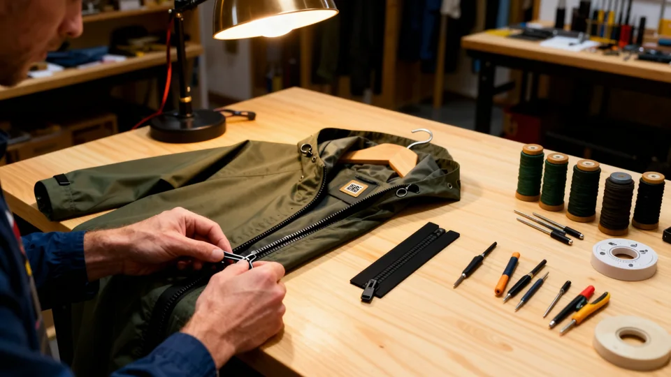

- **Alt text:** A technician replaces the jacket's zip at a repair bench
- **Framing:** focus `45% 55%`, question panel right
- **Made:** Qwen-Image-Edit-2511 with reference images
- **Prompt:** The repair corner at the back of the same Copenhagen store: the same dark moss-green rain jacket lies on a pale oak workbench under a warm lamp, a repair technician's hands replace its zipper with a new matte black zipper, the old zipper set aside, spools of matching thread, seam tape and small tools neatly organised. Repair, resale and longevity made tangible. Photorealistic editorial photograph, 35mm lens.
- **Source:** `work/anchors/textile/nextLife_q7.png`
- **Files:** master `journey-media/final/textile/nextLife.png`; web 4 files (`journey/media/textile/nextLife-1920.avif` …), 1920 AVIF 65 KB
- **Questions:** `Q:nextLife.continuity`, `Q:nextLife.unlock`

> **REFINE** — The collar label is still the old tan label with its own code; data and passport now use the off-white woven label.

## Questions

In travel order; follow-ups sit after the question that can trigger them. At most 2 follow-ups per journey; they never replace a stop's question.

### Q:product.perspective · Product · base (select-persona)

- **Prompt · furniture:** What do you mostly do with this chair?
- **Prompt · battery:** What do you mostly do with this battery?
- **Prompt · textile:** What do you mostly do with this jacket?
- **Detail · furniture:** Pick the closest. The questions that follow are the ones your desk can answer; the journey stays the same length.
- **Detail · battery:** Pick the one closest to the decisions you make. It changes the examples, not the result.
- **Detail · textile:** Pick the one closest to the decisions you make. It changes the examples, not the result.

**Shown on:** `FUR-S02` · `BAT-S02` · `TEX-S02` · **End pane:** `context (shown, never scored)`
**Scores:** —

| Option | Answer | Strength | Records | Flags |
|---|---|---|---|---|
| `Q:product.perspective#leadership` | Run the business | — | persona: leadership | — |
| `Q:product.perspective#product` | Design, make or document it | — | persona: product | — |
| `Q:product.perspective#sustainability` | Check it meets the rules | — | persona: sustainability | — |
| `Q:product.perspective#procurement` | Buy what goes into it | — | persona: procurement | — |
| `Q:product.perspective#sales` | Sell it | — | persona: sales | — |
| `Q:product.perspective#service` | Look after it once it is sold | — | persona: service | — |

### Q:sales.channel · Product · base

**Prompt (furniture only):** Who actually buys this chair from you?

**Detail:** The channel decides who asks the awkward questions, and how often. Pick the one that pays most of the salaries.

**Asked when:** Furniture: everyone, right after the seat. It routes and sizes the rest; never scored.

**Shown on:** `FUR-S02` · **End pane:** `context (shown, never scored)`
**Scores:** —

| Option | Answer | Strength | Records | Flags |
|---|---|---|---|---|
| `Q:sales.channel#consumer` | Consumers, through our own stores or webshop | — | Consumers, through own stores or webshop | — |
| `Q:sales.channel#wholesale` | Retailers and dealers who resell it | — | Retailers and dealers | — |
| `Q:sales.channel#contract` | Contract and project: architects, specifiers, dealers, facility managers | — | Contract and project | — |
| `Q:sales.channel#public` | Public tenders are a meaningful share | — | Public tenders | — |
| `Q:sales.channel#mixed` | A genuine mix; none dominates | — | A genuine mix of channels | — |

### Q:product.identity · Product · base

- **Prompt · furniture:** Today, this chair’s identity lives…
- **Prompt · battery:** Today, this battery’s identity lives…
- **Prompt · textile:** Today, this jacket’s identity lives…
- **Detail · furniture:** Fabrics, oak finishes and sizes multiply one design into many products. A record per variant is what a model-level passport needs.
- **Detail · battery:** Capacities, cell suppliers and firmware multiply one pack into many products — and the battery passport is per individual battery.
- **Detail · textile:** Colours and sizes multiply one style into dozens of products. A record per variant is what a model-level passport needs.

**Shown on:** `FUR-S02` · `BAT-S02` · `TEX-S02` · **End pane:** `L:answers-product`
**Scores:** Data structure and system integration, Traceability depth · spine: product

| Option | Answer | Strength | Records | Flags |
|---|---|---|---|---|
| `Q:product.identity#model-only` | *furniture:* In a model name — fabric and finish are sorted out per order *battery:* In a model name — capacity and firmware versions blur together *textile:* In a style name — colours and sizes are handled as they come | 1 | A model name, variants handled informally | variant-blind |
| `Q:product.identity#variant-list` | *furniture:* In a model with variants we can list *battery:* In a model with variants we can list *textile:* In a style with colours and sizes we can list | 2 | A model with listed variants | — |
| `Q:product.identity#variant-records` | *furniture:* Every fabric and finish variant has its own record *battery:* Every variant has its own part number and spec *textile:* Every colour–size variant has its own SKU record | 4 · battery 2 | A record per variant | — |
| `Q:product.identity#item-level` | *furniture:* Every single chair carries its own serial identity *battery:* Every pack has a serial number linked to its build *textile:* Every garment can be identified individually | — it depends · battery 4 | Item-level identity — Earns its cost in the contract channel — a revenue case, not a compliance one. | — |
| `Q:product.identity#made-to-order` (furniture only) | Each piece is made to order — no two are quite alike | — it depends | Made to order — A business model, not a maturity level. | made-to-order |
| `Q:product.identity#depends` (battery only) | It depends on the product line | — it depends | Varies by product line | varies |

### Q:sourcing.topten · Material · desk

**Prompt (furniture only):** Your ten biggest suppliers by spend. You ask each one for what they already owe or routinely hold on their last delivery, due in a week.

**Detail:** A substances statement, the fibre composition, the panel’s formaldehyde class, the FSC or PEFC claim on the invoice. Not a full material declaration — furniture suppliers do not owe one. Count the ones you would actually get it from.

**Asked when:** Furniture: the purchasing desk's version of the material stop. **Why line:** “A material is only as known as the paperwork that comes with it.”

**Shown on:** `FUR-S03` · **End pane:** `context (shown, never scored)`
**Scores:** — (after the weight table: Supplier data quality, Verification / trust)

| Option | Answer | Strength | Records | Flags |
|---|---|---|---|---|
| `Q:sourcing.topten#eight-plus` | Eight or more. For them it is routine. | — | Eight or more of the ten, as routine | — |
| `Q:sourcing.topten#five-seven` | Five to seven. The fabric mills and the fittings supplier, yes; the frame and foam suppliers would need longer. | — | Five to seven of the ten | — |
| `Q:sourcing.topten#two-four` | Two to four, the ones we already ask regularly. | — | Two to four of the ten | — |
| `Q:sourcing.topten#none-week` | None within a week. A month with chasing for most. | — | None within a week | — |
| `Q:sourcing.topten#never-asked` | We have not asked in that form. Certificates and test reports when needed, yes. | — | Never asked in that form | — |

### Q:sales.artefact · Material · desk

**Prompt (furniture only):** A specifier wants the chair’s composition and certificates in writing. What do you actually send?

**Detail:** Not what you would like to send. What went out last time.

**Asked when:** Furniture: the sales desk's version of the material stop. **Why line:** “What it is made of, as it reaches your customers.”

**Shown on:** `FUR-S03` · **End pane:** `L:answers-customer`
**Scores:** — (after the weight table: DPP data availability, Verification / trust, Sales enablement)

| Option | Answer | Strength | Records | Flags |
|---|---|---|---|---|
| `Q:sales.artefact#maintained` | A datasheet we maintain, with dated certificates attached and a version number on it | 4 | What goes out is a datasheet you maintain, with dated certificates and a version number. | — |
| `Q:sales.artefact#own-then-chase` | Our own datasheet, then the certificates once someone finds them | 3 | What goes out is your own datasheet, then the certificates once someone finds them. | — |
| `Q:sales.artefact#supplier-pdf` | The supplier’s PDF, forwarded as it came | 2 | What goes out is the supplier’s PDF, forwarded as it came. | — |
| `Q:sales.artefact#memory` | An email from memory, or a phone call to someone in product | 1 | What goes out is an email from memory, or a call to someone in product. | — |
| `Q:sales.artefact#varies` | It differs every time; whatever we can find that week | 0 | What a customer gets depends on who they ask. | — |
| `Q:sales.artefact#not-in-writing` | We are not asked in writing | — doesn't apply | Customers do not ask in writing. | — |

### Q:material.composition · Material · base

- **Prompt · furniture:** Up close, a chair is a recipe. How well do you know yours?
- **Prompt · battery:** Up close, a battery is chemistry. How well do you know yours?
- **Prompt · textile:** Up close, a jacket is fibres and coatings. How well do you know yours?
- **Detail · furniture:** Wool blend, oak, foam, glue, lacquer — down to the substances in them.
- **Detail · battery:** Cell chemistry, aluminium housing, seals, thermal pads — and the critical raw materials inside.
- **Detail · textile:** Polyester base, PU coating, water-repellent finish — and what is in them.

**Shown on:** `FUR-S03` · `BAT-S03` · `TEX-S03` · **End pane:** `L:answers-material`
**Scores:** DPP data availability, Verification / trust, Regulatory readiness · spine: material · calculator: hazardous

| Option | Answer | Strength | Records | Flags |
|---|---|---|---|---|
| `Q:material.composition#broad` | We know the main materials, not the exact mix | 1 | Main materials known, exact mix unknown | — |
| `Q:material.composition#declared` | Supplier declarations cover most of it | 2 | Supplier material declarations | needs-clarification |
| `Q:material.composition#specified` | Specified per material, with grades and percentages | 3 | Material specifications with grades | — |
| `Q:material.composition#specified-soc` | Specified per material, with substances of concern declared by the supplier | 4 | Specified per material, substances of concern declared | — |
| `Q:material.composition#tested` | Third-party tested, for the products that carry a label | — it depends | Third-party tested where a label requires it — The ESPR asks for name or CAS, location and concentration — not third-party testing. | — |
| `Q:material.composition#not-sure` | Not sure | — not sure | Composition knowledge unclear | — |

### Q:sales.landing · Component · desk

**Prompt (furniture only):** A dealer writes: “Is the foam free of flame retardants, is the oak FSC, and can I have it in writing by four? It is for a tender.” Who ends up answering?

**Detail:** Follow the email to the person who actually writes the reply. Choose the path you would really take.

**Asked when:** Furniture: the sales desk's version of the component stop. **Why line:** “Buyers ask about the parts: the foam, the oak, the finish.”

**Shown on:** `FUR-S04` · **End pane:** `L:answers-customer`
**Scores:** — (after the weight table: Sales enablement, Operational friction, Organisational ownership)

| Option | Answer | Strength | Records | Flags |
|---|---|---|---|---|
| `Q:sales.landing#sales-record` | Sales, from a product record they can open and trust | 4 | Today a dealer’s question is answered by sales, from a product record they trust. | — |
| `Q:sales.landing#sales-folder` | Sales, after digging through datasheets and certificates in a shared folder | 3 | Today a dealer’s question is answered by sales, after digging through a shared folder. | — |
| `Q:sales.landing#forward-internal` | Product, quality or compliance, once sales forwards it; a day or two | 2 | Today a dealer’s question goes to product, quality or compliance and comes back in a day or two. | — |
| `Q:sales.landing#forward-supplier` | Someone who first has to ask the supplier; a week if the supplier is quick | 1 | Today a dealer’s question waits on a supplier — a week if the supplier is quick. | supplier-dependency |
| `Q:sales.landing#whoever` | Whoever is in that day; sometimes four o’clock passes first | 0 | Today a dealer’s question is answered by whoever is in that day. | governance-gap |
| `Q:sales.landing#rare` | We are rarely asked in that form | — doesn't apply | Dealers rarely ask in that form. | — |

### Q:component.bom · Component · base

- **Prompt · furniture:** Under the cushion: webbing, foam, frame, fittings. Can you tie each material to its component?
- **Prompt · battery:** Inside: cells, BMS, wiring, housing. Can you tie each material to its component?
- **Prompt · textile:** Zip, seam tape, press studs, lining. Can you tie each material to its component?

**Detail:** This is what repair, recycling and a passport all need to know.

**Shown on:** `FUR-S04` · `BAT-S04` · `TEX-S04` · **End pane:** `L:answers-component`
**Scores:** Data structure and system integration, Traceability depth, DPP data availability · spine: component

| Option | Answer | Strength | Records | Flags |
|---|---|---|---|---|
| `Q:component.bom#product-wide` | No — materials are tracked for the product as a whole | 0 | Materials known only product-wide | source-of-friction |
| `Q:component.bom#main-parts` | For the main components only | 2 | Component materials for main parts | — |
| `Q:component.bom#bom` | Yes, through a maintained bill of materials | 3 | A maintained bill of materials | — |
| `Q:component.bom#bom-versioned` | Yes, and the BOM is versioned against each build | 4 | A versioned, build-specific bill of materials | — |
| `Q:component.bom#depends` | It depends on the line: full BOMs for our own designs, less for bought-in pieces | — it depends | BOM depth varies by product line | varies |

### Q:sales.certificates · Supplier · desk

**Prompt (furniture only):** A tender asks for FSC or PEFC chain of custody, an EPD, or a label such as Möbelfakta, the Nordic Swan, the EU Ecolabel or Indoor Air Comfort. Which of yours are current, today?

**Detail:** Certificates lapse quietly. Tender deadlines do not.

**Asked when:** Furniture: the sales desk's version of the supplier stop. **Why line:** “Certificates start with your suppliers, and buyers check them.”

**Shown on:** `FUR-S05` · **End pane:** `L:answers-customer`
**Scores:** — (after the weight table: Verification / trust, Regulatory readiness)

| Option | Answer | Strength | Records | Flags |
|---|---|---|---|---|
| `Q:sales.certificates#tracked` | We know per product, with expiry dates tracked and one person responsible for renewals | 4 | Certificates known per product, expiry dates tracked | — |
| `Q:sales.certificates#company-level` | We know at company level and check per product when a tender lands | 3 | Certificates known at company level, checked per tender | — |
| `Q:sales.certificates#would-check` | We think so; we would check with the certifier or the supplier first | 2 | Certificates checked with the certifier or supplier first | — |
| `Q:sales.certificates#lapsed-once` | We have found out mid-tender that one had lapsed | 1 | A certificate has lapsed mid-tender | — |
| `Q:sales.certificates#buyer-tells-us` | We would not know until a buyer told us | 0 | No certificate register | — |
| `Q:sales.certificates#not-required` | Our customers do not ask for these | — doesn't apply | Customers do not ask for certificates | — |

### Q:supplier.role · Supplier · base

**Prompt (furniture only):** Does the wood in your products arrive from outside the EU?

**Detail:** Finished wooden furniture, parts, panels or timber that you or your contract manufacturer bring in from outside the EU — or timber bought directly from a forest owner anywhere.

**Asked when:** Furniture, every desk except sales, before any wood question: it decides whether EUDR is a filing duty (import) or record-keeping (EU suppliers).

**Shown on:** `FUR-S05` · **End pane:** `context (shown, never scored)`
**Scores:** —

| Option | Answer | Strength | Records | Flags |
|---|---|---|---|---|
| `Q:supplier.role#import` | Yes — we or our contract makers import it | — | Imports the wood: EUDR operator | — |
| `Q:supplier.role#eu-covered` | No — it comes from EU suppliers who file their own statements | — | Buys within the EU: EUDR downstream operator | — |
| `Q:supplier.role#mixed` | Both, depending on the line | — | Operator for some lines, downstream for others | — |
| `Q:supplier.role#dont-know` | I would have to ask purchasing | — | EUDR role not known yet | — |
| `Q:supplier.role#little-wood` | Little or no wood in what we sell | — | Little or no wood: EUDR marginal | — |

### Q:supplier.depth · Supplier · base

**Prompt (furniture only):** When wooden furniture, panels or timber reaches you, does it arrive with a due-diligence statement reference number?

**Detail:** The operator who first placed it on the EU market files the statement; its reference number is what travels with the goods.

**Asked when:** Furniture, when the wood comes from EU suppliers or both ways. Not after “I would have to ask purchasing”: that is answered once.

**Shown on:** `FUR-S05` · **End pane:** `L:answers-supplier`
**Scores:** Traceability depth, Supplier data quality · spine: supplier, material · calculator: tiers

| Option | Answer | Strength | Records | Flags |
|---|---|---|---|---|
| `Q:supplier.depth#every-delivery` | Every delivery, and we keep the reference against the batch | 4 | Statement reference kept against every batch | — |
| `Q:supplier.depth#most` | Most deliveries; we chase the rest | 3 | Statement references for most deliveries | — |
| `Q:supplier.depth#some` | Some suppliers send one; we have not asked the others | 2 | Statement references from some suppliers | supplier-dependency |
| `Q:supplier.depth#none-yet` | Not yet — we have not asked | 1 | No statement references collected yet | supplier-dependency |
| `Q:supplier.depth#we-import` | It does not arrive with one because we import it ourselves | — doesn't apply | Imports its own wood: the operator's due diligence applies | — |
| `Q:supplier.depth#dont-know` | I would have to ask purchasing | — not sure | Statement references: would have to ask purchasing | — |

### Q:supplier.proof · Supplier · followup

**Prompt:** Someone asks you to prove it — tomorrow.
- **Detail · furniture:** A retailer wants the oak’s origin and harvest legality on file.
- **Detail · battery:** An importer wants cobalt and lithium due-diligence evidence.
- **Detail · textile:** A buyer wants proof of the recycled-content claim.

**Asked when:** Right after supplier.trace, when that answer claims deep traceability (strength 3 or more). **Why line:** “That is deep visibility. One check on what stands behind it.”

**Shown on:** `FUR-S05` · `BAT-S05` · `TEX-S05` · **End pane:** `L:answers-supplier`
**Scores:** Verification / trust, Regulatory readiness · spine: material · calculator: certification

| Option | Answer | Strength | Records | Flags |
|---|---|---|---|---|
| `Q:supplier.proof#verified-source` | We attach a verified, current source | 4 | Verified, attributable sourcing evidence | — |
| `Q:supplier.proof#internal-record` | We show an internal record we maintain | 3 | Internal sourcing records | — |
| `Q:supplier.proof#supplier-assertion` | We forward a supplier certificate | 2 | Supplier certificates on file | needs-clarification |
| `Q:supplier.proof#cannot-prove` | We could not prove it reliably | 0 | Sourcing claims without proof | source-of-friction |
| `Q:supplier.proof#depends` | It depends on the supplier | — it depends | Proof varies by supplier | varies |

### Q:supplier.trace · Supplier · base (trace-boundary)

- **Prompt · furniture:** You bring the wood in, so the due diligence is yours. Follow the oak upstream: where does your visibility stop?
- **Prompt · battery:** Follow the cells upstream. Where does your visibility stop?
- **Prompt · textile:** Follow the fabric upstream. Where does your visibility stop?
- **Detail · furniture:** Species, country, the harvest plot’s geolocation and the legality evidence — what a due-diligence statement is built from.
- **Detail · battery:** Pack assembler, cell maker, cathode producer, refinery, mine.
- **Detail · textile:** Garment maker, fabric mill, yarn spinner, polymer.

**Asked when:** Batteries and textiles always. Furniture only on the operator path: the wood is imported (or both), or it arrives without a reference because they import it themselves.

**Shown on:** `FUR-S05` · `BAT-S05` · `TEX-S05` · **End pane:** `L:answers-supplier`
**Scores:** Traceability depth, Supplier data quality · spine: supplier, material · calculator: tiers

| Option | Answer | Strength | Records | Flags |
|---|---|---|---|---|
| `Q:supplier.trace#warehouse` | At our own warehouse door | 0 | Visibility ends at the warehouse | source-of-friction, supplier-dependency |
| `Q:supplier.trace#tier1` | At our direct supplier | 1 | Direct suppliers known (tier 1) | supplier-dependency |
| `Q:supplier.trace#tier2` | One or two tiers beyond them | 3 | Suppliers named two tiers deep | proof-claimed |
| `Q:supplier.trace#tier3` | *furniture:* To the harvest plot — geolocation and legality evidence on file *battery:* To the refinery or mine, with due-diligence evidence *textile:* To the fibre source, with traceability evidence | 4 | Traceable to the raw-material source | proof-claimed |
| `Q:supplier.trace#depends` | *furniture:* It depends on the supplier or the species *battery:* It depends on the material *textile:* It depends on the material | — it depends | Visibility varies by supplier or material | supplier-dependency, varies |

### Q:sourcing.whoasks · Supplier · desk

**Prompt (furniture only):** Compliance needs a substances statement from your biggest frame supplier. How does the request reach them?

**Detail:** The path it would really take, not the org chart.

**Asked when:** Furniture, the compliance desk, when the operator's trace question is not on the path.

**Shown on:** `FUR-S05` · **End pane:** `L:answers-supplier`
**Scores:** — (after the weight table: Cross-functional collaboration, Organisational ownership, Operational friction)

| Option | Answer | Strength | Records | Flags |
|---|---|---|---|---|
| `Q:sourcing.whoasks#buyer-logged` | Through the buyer who owns the account, logged with a due date the supplier is later measured on. | 4 | Requests reach suppliers through the buyer, logged with a due date | — |
| `Q:sourcing.whoasks#buyer-email` | Through the buyer, by email. They chase when they remember. | 3 | Requests go through the buyer, chased when remembered | — |
| `Q:sourcing.whoasks#direct-cc` | Compliance writes to the supplier directly and copies the buyer. | 2 | Compliance writes to suppliers directly, buyer copied | needs-clarification |
| `Q:sourcing.whoasks#direct-alone` | Compliance writes directly. Purchasing hears about it if the supplier complains. | 1 | Compliance writes to suppliers alone; purchasing hears later | governance-gap |
| `Q:sourcing.whoasks#none-yet` | We have not had a request like that yet. | — it depends | No request like that yet | — |

### Q:sourcing.contract · Supplier · desk

**Prompt (furniture only):** A supplier misses a documentation request for the third time. What does the agreement let you do?

**Detail:** Framework agreement, supply agreement or purchase-order terms, whichever actually governs them.

**Asked when:** Furniture: the purchasing desk's version of the supplier stop.

**Shown on:** `FUR-S05` · **End pane:** `L:answers-supplier`
**Scores:** — (after the weight table: Regulatory readiness, Supplier data quality)

| Option | Answer | Strength | Records | Flags |
|---|---|---|---|---|
| `Q:sourcing.contract#nothing-written` | Nothing. Documentation is not in the agreement, so it is a favour. | 0 | Documentation is not in the agreement: it is a favour | governance-gap, source-of-friction |
| `Q:sourcing.contract#on-request` | It says they provide certificates on request. Nothing happens if they do not. | 1 | Certificates on request, with nothing behind it | governance-gap |
| `Q:sourcing.contract#listed-docs` | It lists what they must supply, per delivery or per year. Enforcement is a conversation. | 2 | The agreement lists the documents; enforcement is a conversation | needs-clarification |
| `Q:sourcing.contract#enforceable` | It names the data, the format and the deadline, and ties it to payment, order release or the next review. | 4 | Documentation is enforceable: data, format, deadline, remedy | — |
| `Q:sourcing.contract#varies` | It varies. The big ones have a signed agreement; the rest run on purchase-order terms. | — it depends | Enforcement varies: agreements for the big ones, PO terms for the rest | — |

### Q:sourcing.substitution · Logistics · desk

**Prompt (furniture only):** Your contract manufacturer swaps the foam supplier to hold the price. Who at your end finds out, and what gets updated?

**Detail:** Same density on paper, different chemistry, different declaration. It happens a few times a year.

**Asked when:** Furniture: the purchasing desk's version of the logistics stop.

**Shown on:** `FUR-S06` · **End pane:** `L:answers-supplier`
**Scores:** — (after the weight table: Verification / trust, Data structure and system integration, Operational friction)

| Option | Answer | Strength | Records | Flags |
|---|---|---|---|---|
| `Q:sourcing.substitution#change-approval` | It needs our written approval first. BOM, declaration and product data are updated as part of the approval. | 4 | Substitutions need written approval; the data is updated with it | — |
| `Q:sourcing.substitution#told-updated` | They tell the buyer. The buyer updates the BOM and passes it to whoever owns product data. | 3 | Substitutions told to the buyer; BOM and product data updated | — |
| `Q:sourcing.substitution#told-only` | They tell the buyer. The BOM gets updated if someone remembers; the product data usually does not. | 2 | Substitutions told to the buyer; the BOM maybe, the product data usually not | needs-clarification |
| `Q:sourcing.substitution#discovered` | We find out at a claim, an audit, or when a test report no longer matches. | 1 | Substitutions discovered at claims, audits or mismatched tests | source-of-friction |
| `Q:sourcing.substitution#their-call` | If it meets the spec, it is their call. We would not expect to hear. | — it depends | Substitutions within spec are the maker’s call | — |

### Q:sales.orders · Logistics · desk

**Prompt (furniture only):** An order is packed, but the customer still needs a fabric code, a care text or a certificate before it can go. How often does a missing or wrong product detail hold an order up?

**Detail:** Delays, documents sent twice, a return because the label did not match. Count the ones caused by product data, not by stock.

**Asked when:** Furniture: the sales and after-sales desk's version of the logistics stop. **Why line:** “Product details travel with every order, too.”

**Shown on:** `FUR-S06` · **End pane:** `L:answers-customer`
**Scores:** — (after the weight table: Operational friction, Sales enablement, Data structure and system integration)

| Option | Answer | Strength | Records | Flags |
|---|---|---|---|---|
| `Q:sales.orders#never` | Practically never: orders and their product details come from the same record | 4 | Orders ship with their product details; data does not hold them up | — |
| `Q:sales.orders#rarely` | Now and then, and it is sorted the same day | 3 | A missing product detail now and then, sorted the same day | — |
| `Q:sales.orders#monthly` | Every month or so, and it costs a few days | 2 | Missing product details cost a few days every month or so | source-of-friction |
| `Q:sales.orders#often` | Often: a missing detail or a wrong code is a regular reason for delays or returns | 1 | Missing or wrong product details regularly delay or return orders | source-of-friction |
| `Q:sales.orders#not-seen` | I would not see it; the order desk handles that | — not sure | Order delays from product data: not seen from this desk | — |

### Q:logistics.handoff · Logistics · base

- **Prompt · furniture:** Timber changes hands several times before it becomes a chair. Does its information travel with it?
- **Prompt · battery:** Cells cross borders as dangerous goods before they become a pack. Does their information travel with them?
- **Prompt · textile:** Fabric rolls change hands before they become a jacket. Does their information travel with them?

**Detail:** Batch numbers, certificates, test reports — at every hand-off.

**Shown on:** `FUR-S06` · `BAT-S06` · `TEX-S06` · **End pane:** `L:answers-material`
**Scores:** Traceability depth, Supplier data quality, Data structure and system integration · spine: material, component · calculator: dataSharing

| Option | Answer | Strength | Records | Flags |
|---|---|---|---|---|
| `Q:logistics.handoff#pooled` | No — stock is pooled and the paperwork stays behind | 0 | Hand-offs lose the batch link | supplier-dependency, source-of-friction |
| `Q:logistics.handoff#by-date` | Roughly — we can match by delivery date and documents | 1 | Batches matched by date and paperwork | supplier-dependency |
| `Q:logistics.handoff#by-batch` | Yes — each batch keeps its number from delivery to product | 4 | Batch numbers kept through hand-offs | — |
| `Q:logistics.handoff#by-item` | Yes — down to the individual item | — it depends · battery 4 | Item-level continuity through logistics — Earns its cost in the contract channel — a revenue case, not a compliance one. | — |
| `Q:logistics.handoff#depends` (battery only) | It depends on the supplier | — it depends | Varies by supplier | supplier-dependency, varies |

### Q:logistics.change · Logistics · followup

**Prompt:** A supplier quietly changes a material.
- **Detail · furniture:** A new foam, a different glue, oak from another region.
- **Detail · battery:** A new cell batch from a second plant.
- **Detail · textile:** A different coating chemistry from the mill.

**Asked when:** Right after logistics.handoff, when any answer so far flagged a supplier dependency (never beside the purchasing desk's substitution question). **Why line:** “That points to the supplier boundary. Let’s follow it one step further.”

**Shown on:** `FUR-S06` · `BAT-S06` · `TEX-S06` · **End pane:** `L:answers-supplier`
**Scores:** Supplier data quality, Data structure and system integration, Verification / trust, Operational friction · spine: supplier, material · calculator: dataSharing, contracts

| Option | Answer | Strength | Records | Flags |
|---|---|---|---|---|
| `Q:logistics.change#automatic` | It flows into our product data automatically | 4 | Supplier changes propagate automatically | — |
| `Q:logistics.change#notified-manual` | We are told, then someone updates it by hand | 2 | Supplier changes updated by hand | needs-clarification |
| `Q:logistics.change#discovered-later` | We find out later — sometimes from a customer | 1 | Supplier changes discovered late | source-of-friction, supplier-dependency |
| `Q:logistics.change#unknown` | We probably would not know | 0 | Supplier changes go unnoticed | source-of-friction, supplier-dependency |
| `Q:logistics.change#depends` | It depends on the supplier | — it depends | Varies by supplier | varies |

### Q:sourcing.contractmade · Factory · desk

**Prompt (furniture only):** Of what sells under your name, how much is made by someone else, and do you know who they buy from?

**Detail:** The upholsterer in Poland, the frame plant in Lithuania, the case-goods factory in Vietnam. Their suppliers, not just them.

**Asked when:** Furniture: the purchasing desk's version of the factory stop. **Why line:** “Not every chair is made in your own factory.”

**Shown on:** `FUR-S07` · **End pane:** `L:answers-supplier`
**Scores:** — (after the weight table: Traceability depth, Supplier data quality)

| Option | Answer | Strength | Records | Flags |
|---|---|---|---|---|
| `Q:sourcing.contractmade#own-mostly` | Mostly our own production. What is contract-made runs on our specification and our nominated inputs. | 4 | Mostly own production; contract-made on nominated inputs | — |
| `Q:sourcing.contractmade#nominated` | Most of it is contract-made, but we nominate the wood, foam and fabric suppliers, so the tier below is on our own supplier list. | 4 | Contract-made, with the tier below on our own supplier list | — |
| `Q:sourcing.contractmade#list-on-request` | A large share is contract-made. They source their own inputs and would give us the list if we asked. | 2 | Contract-made on their own inputs; the list on request | supplier-dependency |
| `Q:sourcing.contractmade#their-business` | A large share is contract-made and their sourcing is their business, as long as the spec is met. | 1 | Contract-made; their sourcing is their business | supplier-dependency |
| `Q:sourcing.contractmade#by-line` | It differs by product line. Upholstery one way, case goods another. | — it depends | Contract sourcing differs by product line | — |

### Q:sales.reorder · Factory · desk

**Prompt (furniture only):** A facility manager calls. One chair from the 2,000 you installed in 2018 needs replacing: same fabric, same finish.

**Detail:** Can you tell which chair it was, and can you still make it?

**Asked when:** Furniture: the sales and after-sales desk's version of the factory stop. **Why line:** “What the factory recorded decides what you can still make.”

**Shown on:** `FUR-S07` · **End pane:** `L:answers-customer`
**Scores:** — (after the weight table: After-sales / lifecycle capability, Traceability depth, Commercial use of product data)

| Option | Answer | Strength | Records | Flags |
|---|---|---|---|---|
| `Q:sales.reorder#project-record` | Yes: project, variant and fabric lot are on record, and we can quote today | 4 | Project, variant and fabric lot on record | — |
| `Q:sales.reorder#variant-yes` | Model and variant, yes; the fabric we would match from a sample | 3 | Model and variant on record; fabric matched from a sample | — |
| `Q:sales.reorder#old-order` | We would dig out the 2018 order confirmation, if we can find it | 2 | Identity lives in the old order confirmation | — |
| `Q:sales.reorder#photo` | We would ask for a photo and a label and work from there | 1 | The customer becomes the record | — |
| `Q:sales.reorder#current-range` | We could not identify it; we would offer the current range | 0 | Installed chairs cannot be identified later | — |
| `Q:sales.reorder#no-projects` | We do not sell into projects; customers buy the current model | — doesn't apply | No project sales | — |

### Q:factory.evidence · Factory · base

- **Prompt · furniture:** On the production floor, what is recorded about how each chair was made?
- **Prompt · battery:** On the line, what is recorded about how each pack was built?
- **Prompt · textile:** On the sewing floor, what is recorded about how each jacket was made?
- **Detail · furniture:** Work orders, fabric lots, glue batches, quality checks.
- **Detail · battery:** Cell lots, weld checks, end-of-line tests, firmware version.
- **Detail · textile:** Cut lots, seam-sealing checks, inspection results.

**Shown on:** `FUR-S07` · `BAT-S07` · `TEX-S07` · **End pane:** `L:answers-component`
**Scores:** Verification / trust, Traceability depth, Data structure and system integration · spine: component, product

| Option | Answer | Strength | Records | Flags |
|---|---|---|---|---|
| `Q:factory.evidence#not-reliably` | Not reliably — it lives in people’s heads | 0 | Production history undocumented | source-of-friction |
| `Q:factory.evidence#site-week` | Site and production week | 1 | Production site and week | — |
| `Q:factory.evidence#work-order` | Work order, line and quality checks | 3 | Work-order and quality records | — |
| `Q:factory.evidence#per-unit` | Per unit — timestamped, with test results | 3 · battery 4 | Per-unit production records | — |
| `Q:factory.evidence#depends` | It depends on the site or line | — it depends | Varies by site or line | varies |

### Q:data.location · Data · base

**Prompt:** So where does all of this actually live today?

**Detail:** The main home for product and supplier information.

**Shown on:** `FUR-S08` · `BAT-S08` · `TEX-S08` · **End pane:** `L:answers-product`
**Scores:** Data structure and system integration, Information retrieval · spine: product · calculator: dataAvailability

| Option | Answer | Strength | Records | Flags |
|---|---|---|---|---|
| `Q:data.location#human` | In people’s heads and inboxes | 0 | People and inboxes | — |
| `Q:data.location#pdf-email` | In supplier PDFs and email threads | 1 | Supplier PDFs and email | — |
| `Q:data.location#spreadsheet` | In spreadsheets we maintain ourselves | 2 | Self-maintained spreadsheets | — |
| `Q:data.location#partial-erp` | Partly in ERP / PLM, partly elsewhere | 3 | ERP / PLM plus side files | — |
| `Q:data.location#full-erp` | In ERP / PLM / PIM — connected | 4 | Connected ERP / PLM / PIM | — |
| `Q:data.location#not-sure` | Not sure | — not sure | Where the data lives is unclear | — |

### Q:data.retrieval · Data · followup

- **Prompt · furniture:** A retailer needs the chair’s full material breakdown by tomorrow morning.
- **Prompt · battery:** An importer needs the pack’s chemistry and carbon data by tomorrow morning.
- **Prompt · textile:** A buyer needs the jacket’s fibre and chemical data by tomorrow morning.

**Detail:** Choose the path you would really take.

**Asked when:** Right after data.location, when that answer is weak or partial (strength 2 or less); not for sales, whose dealer-email question already tests it. **Why line:** “Then a practical test of that path.”

**Shown on:** `FUR-S08` · `BAT-S08` · `TEX-S08` · **End pane:** `L:answers-product`
**Scores:** Information retrieval, Operational friction, Supplier data quality · spine: product, customer

| Option | Answer | Strength | Records | Flags |
|---|---|---|---|---|
| `Q:data.retrieval#immediate` | I can pull a verified answer immediately | 4 | Answers retrieved on demand | — |
| `Q:data.retrieval#search` | I would search across systems and colleagues | 2 | Answers assembled by searching | needs-clarification |
| `Q:data.retrieval#ask-supplier` | I would have to ask a supplier | 1 | Answers depend on suppliers | supplier-dependency |
| `Q:data.retrieval#cannot` | I could not give a reliable answer | 0 | No reliable answer path | source-of-friction |
| `Q:data.retrieval#depends` | It depends on what exactly they ask for | — it depends | Varies by the data asked for | varies |

### Q:sourcing.pdf · Data · desk

**Prompt (furniture only):** A supplier’s certificate and test report arrive. What happens to the numbers inside them?

**Detail:** Certificate number and expiry, formaldehyde class, flammability result, fibre composition. The values, not the file.

**Asked when:** Furniture: the compliance desk's version of the data stop. **Why line:** “Supplier evidence arrives as documents; the data sits inside them.”

**Shown on:** `FUR-S08` · **End pane:** `L:answers-product`
**Scores:** — (after the weight table: Data structure and system integration, Verification / trust, Operational friction)

| Option | Answer | Strength | Records | Flags |
|---|---|---|---|---|
| `Q:sourcing.pdf#filed` | The PDF is filed or forwarded. The values stay inside it. | 0 | Supplier evidence is stored as documents; the values stay inside | source-of-friction |
| `Q:sourcing.pdf#checked-filed` | Someone checks it against the spec, then files it. | 1 | Supplier evidence is checked once, then filed as documents | — |
| `Q:sourcing.pdf#keyed-by-hand` | Key values are typed into a spreadsheet or the ERP by hand. | 2 | Supplier evidence is re-keyed by hand | — |
| `Q:sourcing.pdf#structured` | The supplier submits the values in a structured form or template; the PDF sits behind the record as evidence. | 4 | Supplier evidence arrives as data, with the document attached | — |
| `Q:sourcing.pdf#depends-desk` | It depends who receives it. Purchasing files, quality reads, compliance keys in some of it. | — it depends | Supplier evidence is handled differently by each desk | varies |

### Q:sales.hours · Data · desk

**Prompt (furniture only):** Last month, roughly how many working hours went into answering customers’ questions about materials, origin or certificates, and whose were they?

**Detail:** Count everyone: sales, product, quality, compliance, and the supplier you chased. Your number, not ours.

**Asked when:** Furniture: the sales desk's version of the data stop. **Why line:** “Every answer costs somebody time.”

**Shown on:** `FUR-S08` · **End pane:** `context (shown, never scored)`
**Scores:** — (after the weight table: Operational friction)

| Option | Answer | Strength | Records | Flags |
|---|---|---|---|---|
| `Q:sales.hours#none` | Practically none | — | Practically none | — |
| `Q:sales.hours#day-sales` | About a day, mostly in sales | — | About a day, mostly in sales | — |
| `Q:sales.hours#days-mixed` | A few days, split between sales and product or quality | — | A few days, split between sales and product or quality | — |
| `Q:sales.hours#week-plus` | A week or more, and it pulled people out of product, quality or compliance | — | A week or more, pulling people out of product, quality or compliance | — |
| `Q:sales.hours#everyone` | More than that, or we cannot tell because it is everyone’s side job | — | More than that — everyone’s side job | — |
| `Q:sales.hours#want-to-know` | No idea, and I would like to | — | No idea yet | — |

### Q:data.owner · Data · base

**Prompt:** When this information changes, who makes sure it is updated?

**Detail:** Ownership decides whether any of this stays true.

**Shown on:** `FUR-S08` · `BAT-S08` · `TEX-S08` · **End pane:** `L:answers-product`
**Scores:** Organisational ownership, Cross-functional collaboration, Operational friction · calculator: ownership

| Option | Answer | Strength | Records | Flags |
|---|---|---|---|---|
| `Q:data.owner#named-owner` | A named owner with a mandate | 4 | A named data owner | — |
| `Q:data.owner#per-department` | Each department keeps its own version | 2 | Parallel versions per department | needs-clarification |
| `Q:data.owner#whoever-notices` | Whoever notices first | 1 | Updates depend on whoever notices | governance-gap |
| `Q:data.owner#nobody` | Honestly, nobody in particular | 0 | No owner for product data | governance-gap, source-of-friction |
| `Q:data.owner#depends` | It depends on the data — some has an owner, some does not | — it depends | Ownership varies by data | varies |

### Q:sales.unbid · Passport · desk

**Prompt (furniture only):** If any question about material, origin or certification could be answered within a day, what would you bid on that you do not bid on today?

**Detail:** Answer as pipeline, not as principle. If you can name the customer, name it.

**Asked when:** Furniture: the sales desk's version of the passport stop. **Why line:** “A passport puts these answers within any buyer’s reach.”

**Shown on:** `FUR-S09` · **End pane:** `context (shown, never scored)`
**Scores:** — (after the weight table: Commercial use of product data)

| Option | Answer | Strength | Records | Flags |
|---|---|---|---|---|
| `Q:sales.unbid#nothing` | Nothing; we already bid on everything we want to | — | Nothing new to bid on | — |
| `Q:sales.unbid#public` | Public tenders we skip because of the documentation load | — | Public tenders skipped today | — |
| `Q:sales.unbid#projects` | Larger contract or project specifications with sustainability annexes | — | Larger project specifications with sustainability annexes | — |
| `Q:sales.unbid#chains-export` | Retail chains or export markets whose onboarding we never attempted | — | Retail chains or export markets not attempted | — |
| `Q:sales.unbid#frameworks` | Framework agreements or preferred-supplier lists with customers we already have | — | Framework agreements with existing customers | — |
| `Q:sales.unbid#never-asked` | Hard to say; nobody has put it like that | — | Hard to say yet | — |

### Q:passport.carrier · Passport · base

- **Prompt · furniture:** Someone points a phone at the chair. What can they reach today?
- **Prompt · battery:** A mechanic scans the battery. What can they reach today?
- **Prompt · textile:** A customer scans the jacket’s label. What can they reach today?
- **Detail · furniture:** The code on the product is where a passport starts — and model level is the likely baseline for furniture.
- **Detail · battery:** The code on the battery is where its passport starts — and it has to open this battery’s own record.
- **Detail · textile:** The code on the label is where a passport starts — the textile rules will set the level.

**Shown on:** `FUR-S09` · `BAT-S09` · `TEX-S09` · **End pane:** `L:answers-customer`
**Scores:** DPP data availability, Sales enablement, After-sales / lifecycle capability, Commercial use of product data · spine: customer, product

| Option | Answer | Strength | Records | Flags |
|---|---|---|---|---|
| `Q:passport.carrier#no-carrier` | Nothing — there is no identifier to scan | 0 | No data carrier on the product | source-of-friction |
| `Q:passport.carrier#generic-page` | A generic product page or manual | 1 | A generic product page | — |
| `Q:passport.carrier#model-data` | Model data: materials, care, documents | 4 · battery 2 | Model-level data behind a code | — |
| `Q:passport.carrier#item-data` | *furniture:* This exact chair — its origin, parts and repairs *battery:* This exact pack — chemistry, state of health, history *textile:* This exact jacket — origin, care and repairs | — it depends · battery 4 | Item-level data behind a code — Earns its cost in the contract channel — a revenue case, not a compliance one. | — |
| `Q:passport.carrier#depends` (battery only) | It depends on the product — some carry a code, some do not | — it depends | A code on some products, not others | varies |

### Q:regulation.scope · Passport · desk

**Prompt (furniture only):** A board member asks which of your products the EU rules touch first, and when. What can you say?

**Detail:** EUDR covers wooden furniture from 30 December 2026 (micro and small makers of wooden seats: June 2027). A furniture passport comes later, on a date not yet set.

**Asked when:** Furniture, the leadership desk, after the passport question: which products the rules touch, and when.

**Shown on:** `FUR-S09` · **End pane:** `context (shown, never scored)`
**Scores:** — (after the weight table: Regulatory readiness, Organisational ownership)

| Option | Answer | Strength | Records | Flags |
|---|---|---|---|---|
| `Q:regulation.scope#mapped` | We have it mapped: which lines carry wood, and what the ecodesign plan says about furniture | — | The rules are mapped to the product lines | — |
| `Q:regulation.scope#eudr-known` | We know which lines EUDR touches; the passport we follow as it develops | — | EUDR is mapped; the passport is followed as it develops | — |
| `Q:regulation.scope#aware` | We know rules are coming; we have not mapped them to our products | — | Aware of the rules, not mapped to products | — |
| `Q:regulation.scope#not-looked` | We have not looked into it yet | — | Not looked into yet | — |
| `Q:regulation.scope#customer-led` | We act when our customers ask for it | — | Acts when customers ask | — |

### Q:nextLife.continuity · Next life · base

- **Prompt · furniture:** Years later the chair comes back for new upholstery. What still knows it?
- **Prompt · battery:** Three years on, the battery is weaker. Does anyone know its history?
- **Prompt · textile:** Two winters later, the zip breaks. Does anyone know how this jacket was made?

**Detail:** Repair, resale, refurbishment and recycling all start from identity.

**Asked when:** Every desk except purchasing, which does not see the chair after it is sold.

**Shown on:** `FUR-S10` · `BAT-S10` · `TEX-S10` · **End pane:** `L:answers-nextLife`
**Scores:** After-sales / lifecycle capability, Traceability depth, Cross-functional collaboration · spine: customer, nextLife

| Option | Answer | Strength | Records | Flags |
|---|---|---|---|---|
| `Q:nextLife.continuity#full` | Its identity and data carry into repair, resale and recycling | — it depends · battery 4 | Identity survives into next life — Real for the contract channel, optional for retail. — Optional unless the textile rules ask for it. | — |
| `Q:nextLife.continuity#repair-parts` | Repair and spare parts are traceable | 4 · battery 3 | Traceable repair and spare parts | — |
| `Q:nextLife.continuity#delivery-only` | We track it to delivery, then lose the thread | 1 | Identity lost after delivery | lifecycle-gap |
| `Q:nextLife.continuity#none` | Once it is sold, it is gone | 0 | No life after sale in the data | lifecycle-gap, source-of-friction |
| `Q:nextLife.continuity#depends` (battery only) | It depends on the channel or customer | — it depends | Varies by channel or customer | varies |

### Q:nextLife.unlock · Next life · base

**Prompt:** If this information were connected tomorrow, what should it unlock first?

**Detail:** Pick the one that matters most from your seat.

**Shown on:** `FUR-S10` · `BAT-S10` · `TEX-S10` · **End pane:** `context (shown, never scored)`
**Scores:** —

| Option | Answer | Strength | Records | Flags |
|---|---|---|---|---|
| `Q:nextLife.unlock#faster-answers` | Faster answers for customers and colleagues | — | priority: faster-buyer-proof | — |
| `Q:nextLife.unlock#sales-proof` | Proof that wins deals | — | priority: faster-buyer-proof | — |
| `Q:nextLife.unlock#passport-ready` | Being ready for the Digital Product Passport | — | priority: dpp-foundation | — |
| `Q:nextLife.unlock#second-life` | *furniture:* Repair, spare parts and re-upholstery services *battery:* Second life, refurbishment and recycling value *textile:* Repair, resale and take-back | — | priority: repair-lifecycle | — |

## End pane (answer-map-1.2)

Built by `pathfinder/answer-map.js` from the finalized journey and rendered by `journey/landscape.js`: the company's own answers on the lifecycle. No score, percentage, count or timeline (a contract test checks that the model carries no number at all).

### L:context · Header · who answered

“Answered from” the seat (Q:product.perspective) and the “First priority” (Q:nextLife.unlock) — context, never scored. No counts, no percentages.

### L:diagram · Lifecycle diagram

Six nodes (supplier → material → component → product → customer → next life) and the five links between them. Each mark comes from the scored answers placed there, on the options' own ladder: Holds / Partly / Weak / Broken; Open when only unscored rungs (“it depends”, “not sure”, “doesn't apply”) speak to it. The caption names where information first gets lost (the first weak or broken link). Clicking a node scrolls to its answers.

### L:answers-supplier · What you told us · Supplier

The answers to Q:supplier.depth, Q:supplier.trace, Q:supplier.proof, Q:logistics.change, Q:sourcing.whoasks, Q:sourcing.contract, Q:sourcing.onboarding, Q:sourcing.contractmade, Q:sourcing.irreplaceable, Q:sourcing.substitution (only those asked), each under its question in the respondent's own words, marked holds (3–4) / partly (2) / gap (0–1), or by their unscored rung: it depends / not sure / doesn't apply (with the option's note, e.g. why item level is not scored). From the Sourcing seat (furniture), the purchasing module's seven ladders appear here tagged “Sourcing desk”; under Q:sourcing.contract, a varies-or-weaker answer earns the free PO-terms advice.

### L:answers-material · What you told us · Material

The answers to Q:material.composition, Q:logistics.handoff, Q:sourcing.com (only those asked), each under its question in the respondent's own words, marked holds (3–4) / partly (2) / gap (0–1), or by their unscored rung: it depends / not sure / doesn't apply (with the option's note, e.g. why item level is not scored).

### L:answers-component · What you told us · Component

The answers to Q:component.bom, Q:factory.evidence (only those asked), each under its question in the respondent's own words, marked holds (3–4) / partly (2) / gap (0–1), or by their unscored rung: it depends / not sure / doesn't apply (with the option's note, e.g. why item level is not scored).

### L:answers-product · What you told us · Product

The answers to Q:product.identity, Q:data.location, Q:data.owner, Q:data.retrieval, Q:sourcing.pdf (only those asked), each under its question in the respondent's own words, marked holds (3–4) / partly (2) / gap (0–1), or by their unscored rung: it depends / not sure / doesn't apply (with the option's note, e.g. why item level is not scored).

### L:answers-customer · What you told us · Customer

The answers to Q:passport.carrier, Q:sales.landing, Q:sales.artefact, Q:sales.certificates, Q:sales.orders, Q:sales.reorder (only those asked), each under its question in the respondent's own words, marked holds (3–4) / partly (2) / gap (0–1), or by their unscored rung: it depends / not sure / doesn't apply (with the option's note, e.g. why item level is not scored). From the Sales seat (furniture), the sales module's four ladders appear here tagged “Sales desk”.

### L:answers-nextLife · What you told us · Next life

The answers to Q:nextLife.continuity (only those asked), each under its question in the respondent's own words, marked holds (3–4) / partly (2) / gap (0–1), or by their unscored rung: it depends / not sure / doesn't apply (with the option's note, e.g. why item level is not scored).

### L:next · Make this reliable next

Up to three first moves from the capability model and the weakest links, plus “Where it pays back” notes (C:opportunity-…). When an answer varies (“It depends on the supplier / the line …”), the first move is C:depends-move. From the Sales seat, “Where it pays back · Faster answers” echoes Q:sales.landing and Q:sales.artefact in the respondent's words, with Q:sales.volume and Q:sales.hours as answered — never priced; Q:sales.unbid stays for the call. From the Sourcing seat, “What your suppliers can deliver today” echoes Q:sourcing.whoasks and Q:sourcing.irreplaceable, with the Q:sourcing.topten count as answered. No timeline.

### L:passport · Furniture: What the ESPR framework can ask for, and where furniture is likely to land

C:regulation-furniture, then the rows below that the respondent's answers speak to (a row shows when one of its questions was asked), captioned “Drawn from the Commission’s draft of 22 September 2026, which says its list should not yet be read as requirements.” and followed by “Plus identifiers, operator details, CN code and compliance documents, which any passport system supplies from master data.”. Then the EUDR block: C:eudr-intro plus the copy for the answer to Q:supplier.role. Batteries and textiles keep “Before the passport”: C:regulation-…, C:passport-level-… and the field names below (no status).

| Field | Likely level | Basis | Shown when asked |
|---|---|---|---|
| Primary materials per component; upholstery fibre composition | model / component | [I] | `Q:material.composition` `Q:component.bom` `Q:sourcing.topten` `Q:sales.artefact` |
| Substances of concern: name or CAS, location in the product, concentration | component / batch, tiered access | [C] it will be asked; thresholds [I] | `Q:material.composition` `Q:sourcing.topten` `Q:sourcing.com` |
| Durability; repairability; recyclability | model | [I] | `Q:nextLife.continuity` |
| Joining methods; disassembly and end-of-life information; recycling route | model / component | [I] | `Q:component.bom` |
| Care, assembly and repair instructions; spare-part availability; take-back information | model | [I] | `Q:nextLife.continuity` `Q:sales.orders` |
| Adhesives, coatings, preservatives, flame retardants; VOC and formaldehyde class | component / batch | [I] | `Q:sales.landing` `Q:sourcing.topten` `Q:sourcing.pdf` `Q:sourcing.com` |
| Wood species, country of production, DDS reference | batch | [C] as EUDR data; [I] as passport field | `Q:supplier.depth` `Q:supplier.trace` |
| Harvest-plot geolocation, supplier identities | batch | [I] restricted, likely not public | `Q:supplier.trace` |
| Forestry certifications; eco-labels | material / batch | [I] | `Q:sales.certificates` `Q:sales.artefact` `Q:sourcing.topten` `Q:sourcing.pdf` |
| Carbon footprint; environmental footprint or EPD | model | [?] | `Q:sales.certificates` |
| Expected lifetime; manufacturing date; repair and replacement history | item | [?] | `Q:sales.reorder` |

| Field | furniture | battery | textile |
|---|---|---|---|
| composition | Material composition | Chemistry & raw materials | Fibre composition |
| origin | Wood origin | Supply-chain due diligence | Where each step was made |
| hazards | Substances in finishes & foam | Hazardous substances | Substances of concern |
| durability | Durability & spare parts | State of health | Durability & repair |
| carbon | Carbon footprint | Carbon footprint | Environmental footprint |
| endOfLife | Disassembly & end of life | Recycled content & end of life | Recyclability & take-back |

## Overlays and copy

### O:data · This code connects to (data stop)

Batch ← Q:logistics.handoff; Work order ← Q:factory.evidence; Source evidence ← Q:supplier.proof or Q:supplier.depth; Bill of materials ← Q:component.bom. Each row shows linked / partial / missing from that answer's strength, or open for an unscored rung.

### O:passport-furniture · Passport card (passport stop) · furniture

“Furniture passport · draft fields”: Materials per component (model); Substances of concern (component / batch); Care, repair & spare parts (model); Disassembly & end of life (model); Wood species, country, DDS reference (batch). Footnote: “Commission draft, 22 Sept 2026 — not yet requirements”. No status per field.

### O:passport-battery · Passport card (passport stop) · battery

“Battery passport · from 18 Feb 2027”: Chemistry & raw materials (per battery); Supply-chain due diligence (per battery); Hazardous substances (per battery); State of health (per battery); Carbon footprint (per battery); Recycled content & end of life (per battery). Footnote: “EU Battery Regulation, Annex XIII”. No status per field.

### O:passport-textile · Passport card (passport stop) · textile

“Textile passport · fields to be set”: Fibre composition (act decides); Where each step was made (act decides); Substances of concern (act decides); Durability & repair (act decides); Environmental footprint (act decides); Recyclability & take-back (act decides). Footnote: “ESPR textile rules planned for 2027 — not yet law”. No status per field.

### C:regulation-furniture · Regulation note · furniture

Furniture is a priority product group in the EU’s 2025–2030 ecodesign working plan. The Commission’s indicative plan is to adopt furniture requirements in 2028; with the minimum transition period in the ESPR, a furniture Digital Product Passport would apply from around 2030. The exact data fields are not yet law.

### C:regulation-battery · Regulation note · battery

Under the EU Battery Regulation, every LMT battery (e-bikes, e-scooters), every industrial battery over 2 kWh and every EV battery placed on the EU market needs its own battery passport from 18 February 2027 — one per battery, opened through a QR code.

### C:regulation-textile · Regulation note · textile

Textiles, apparel first, are a priority product group in the EU’s 2025–2030 ecodesign working plan. The Commission’s indicative plan is to adopt textile requirements in 2027, and the ESPR allows at least 18 months before they apply. The exact data fields are not yet law.

### C:passport-level-furniture · Passport kept per · furniture

model as the baseline, batch where origin varies — item level is voluntary (Commission draft, September 2026)

### C:passport-level-battery · Passport kept per · battery

item — one passport per battery

### C:passport-level-textile · Passport kept per · textile

model or batch — the ESPR textile rules will set it

### C:eudr-intro · EUDR · intro (furniture)

Before that, from 30 December 2026, wooden furniture placed on the EU market must be covered by an EUDR due-diligence statement: filed by you if you import, kept on record from your suppliers if you buy within the EU. Micro and small makers of wooden seats have until 30 June 2027.

### C:eudr-import · EUDR · role: import

You import, so the due diligence is yours: species, country of production, the harvest plot’s geolocation, legality evidence and a risk assessment, filed as a due-diligence statement before the wood is placed on the market.

### C:eudr-eu-covered · EUDR · role: eu-covered

Your EU suppliers file the statements. Yours is a record: who supplied you and whom you supplied, plus the statement reference number where your supplier is the operator — kept for five years, and registered in the EU information system if you are not an SME. The EUDR asks no bill of materials or evidence store of you.

### C:eudr-mixed · EUDR · role: mixed

Both apply, line by line: the full due diligence for what you import, the record-keeping for what you buy within the EU. Worth mapping which lines are which.

### C:eudr-dont-know · EUDR · role: dont-know

Worth asking purchasing first: the answer decides whether the EUDR is a filing duty for you (you import) or a filing-cabinet duty (you buy within the EU).

### C:eudr-little-wood · EUDR · role: little-wood

With little or no wood in what you sell, the EUDR is marginal for you: it covers wooden seats and wooden furniture, and their parts.

### C:depends-move · First move after “It depends”

Where you said “it depends”, name the product lines or suppliers where the answer is already yes — and start there.

### C:opportunity-faster-buyer-proof · Where it pays back · Faster answers

furniture: Answer retailer, tender and specifier questions in minutes instead of weeks. | battery: Answer OEM and importer data requests without chasing cell suppliers. | textile: Answer buyer and retailer data requests in minutes.

### C:opportunity-dpp-foundation · Where it pays back · Passport preparation

A passport built from data you already maintain — not a one-off compliance project.

### C:opportunity-repair-lifecycle · Where it pays back · Service & next life

furniture: Spare parts, re-upholstery and resale that know each chair’s own history. | battery: State-of-health-backed resale, refurbishment and second-life value. | textile: Repair, resale and take-back that know how the garment was made.

### C:opportunity-supplier-change-control · Where it pays back · Supplier-change control

See supplier material changes before your customers do.

### C:opportunity-governance · Where it pays back · Ownership

One owner, one version — improvements that stick.

## Internal preview: scored dashboard (dashboard-1.0)

Not shown in the demo — kept for when the scoring has a defensible weighting. Open it with `?view=dashboard`. Built by `pathfinder/dashboard.js`; every number is a count of the respondent's own answers.

### D:passport · Passport data

The six passport fields (composition, origin, hazards, durability, carbon, end of life), named per branch. Ready = verified from the answers; claimed = asserted but not proven (lighter bar); missing otherwise.

| Field | furniture | battery | textile |
|---|---|---|---|
| composition | Material composition | Chemistry & raw materials | Fibre composition |
| origin | Wood origin | Supply-chain due diligence | Where each step was made |
| hazards | Substances in finishes & foam | Hazardous substances | Substances of concern |
| durability | Durability & spare parts | State of health | Durability & repair |
| carbon | Carbon footprint | Carbon footprint | Environmental footprint |
| endOfLife | Disassembly & end of life | Recycled content & end of life | Recyclability & take-back |

> **OK** — Only verified fields count as ready; claimed fields show as the lighter bar segment.

### D:links · Lifecycle links

The five links supplier → material → component → product → customer → next life. A link holds when the answers that carry it are connected or verified; partial counts as 'partly'; weak, broken or unanswered do not.

### D:capabilities · Data capabilities

The 13 capability dimensions of the Pathfinder model. Solid = score 61+ (repeatable), partial = 41–60, otherwise person-dependent or not assessed.

### D:attention-suppliers · Needs attention · Suppliers

The answers given to Q:supplier.depth, Q:supplier.trace, Q:supplier.proof, Q:logistics.change, Q:sourcing.whoasks, Q:sourcing.contract, Q:sourcing.onboarding, Q:sourcing.contractmade, Q:sourcing.irreplaceable, Q:sourcing.substitution (follow-ups only when asked). OK = strength 3 or 4; everything else needs attention.

### D:attention-materials · Needs attention · Materials

The answers given to Q:material.composition, Q:logistics.handoff, Q:sourcing.com (follow-ups only when asked). OK = strength 3 or 4; everything else needs attention.

### D:attention-components · Needs attention · Components

The answers given to Q:component.bom, Q:factory.evidence (follow-ups only when asked). OK = strength 3 or 4; everything else needs attention.

### D:attention-records · Needs attention · Product records

The answers given to Q:product.identity, Q:data.location, Q:data.owner, Q:data.retrieval, Q:sourcing.pdf (follow-ups only when asked). OK = strength 3 or 4; everything else needs attention.

### D:attention-passport · Needs attention · Passport & customers

The answers given to Q:passport.carrier, Q:sales.landing, Q:sales.artefact, Q:sales.certificates, Q:sales.orders, Q:sales.reorder (follow-ups only when asked). OK = strength 3 or 4; everything else needs attention.

### D:attention-nextLife · Needs attention · Next life

The answers given to Q:nextLife.continuity (follow-ups only when asked). OK = strength 3 or 4; everything else needs attention.

